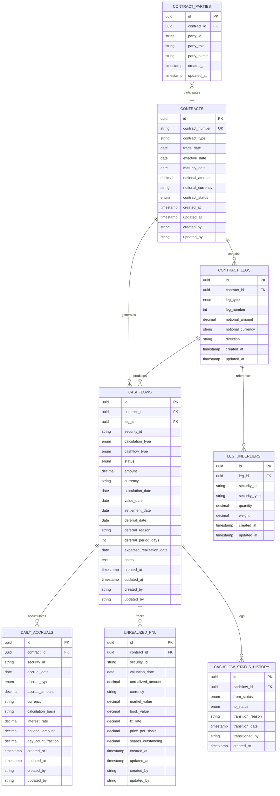

# 🗃️ Database Entity-Relationship Design

## Overview

The Cashflow Generation Service employs a comprehensive database design optimized for high-performance cashflow processing, thread partitioning, and Actor pattern implementation. This document provides detailed ER diagrams, relationship analysis, and architectural considerations.

## 📊 Entity-Relationship Diagram



## 🔗 Relationship Analysis

### 1. Primary Relationships

#### **Contract ↔ Cashflows (1:N)**
- **Cardinality**: One contract generates many cashflows
- **Foreign Key**: `cashflows.contract_id → contracts.id`
- **Business Logic**: Each equity swap contract produces multiple cashflows over its lifecycle
- **Cascade Rule**: `CASCADE ON DELETE` (when contract is deleted, all cashflows are removed)

#### **Contract ↔ Contract Legs (1:N)**
- **Cardinality**: One contract contains multiple legs (typically 2: equity leg + interest leg)
- **Foreign Key**: `contract_legs.contract_id → contracts.id`
- **Business Logic**: Equity swaps have at least two legs representing different payment streams
- **Cascade Rule**: `CASCADE ON DELETE`

#### **Contract Leg ↔ Cashflows (1:N)**
- **Cardinality**: One leg produces many cashflows
- **Foreign Key**: `cashflows.leg_id → contract_legs.id`
- **Business Logic**: Each leg generates its own cashflow stream
- **Cascade Rule**: `CASCADE ON DELETE`

#### **Contract Leg ↔ Leg Underliers (1:N)**
- **Cardinality**: One leg references multiple underliers (for basket swaps)
- **Foreign Key**: `leg_underliers.leg_id → contract_legs.id`
- **Business Logic**: Equity legs can reference single stocks, indices, or baskets
- **Cascade Rule**: `CASCADE ON DELETE`

### 2. Dependent Relationships

#### **Cashflows ↔ Daily Accruals (1:N)**
- **Cardinality**: One cashflow accumulates many daily accruals
- **Foreign Key**: `daily_accruals.contract_id` (logical relationship)
- **Business Logic**: Interest and dividend cashflows accumulate daily
- **Cascade Rule**: `SET NULL ON DELETE` (preserve historical accruals)

#### **Cashflows ↔ Unrealized P&L (1:N)**
- **Cardinality**: One performance cashflow tracks multiple valuation points
- **Foreign Key**: `unrealized_pnl.contract_id` (logical relationship)
- **Business Logic**: Equity performance tracked through time series
- **Cascade Rule**: `SET NULL ON DELETE`

#### **Cashflows ↔ Status History (1:N)**
- **Cardinality**: One cashflow has multiple status transitions
- **Foreign Key**: `cashflow_status_history.cashflow_id → cashflows.id`
- **Business Logic**: Complete audit trail of cashflow lifecycle
- **Cascade Rule**: `CASCADE ON DELETE`

### 3. Reference Relationships

#### **Contract ↔ Contract Parties (1:N)**
- **Cardinality**: One contract involves multiple parties
- **Foreign Key**: `contract_parties.contract_id → contracts.id`
- **Business Logic**: Counterparty management and settlement instructions
- **Cascade Rule**: `CASCADE ON DELETE`

## 🏗️ Architectural Patterns

### 1. Thread Partitioning Support

The database design supports **thread partitioning** by enabling efficient data isolation:

```sql
-- Thread partition key composition
SELECT 
    contract_id,
    security_id,
    calculation_type
FROM cashflows
WHERE contract_id = ? AND security_id = ? AND calculation_type = ?;
```

**Design Benefits**:
- **Isolation**: Each thread operates on distinct data partitions
- **Concurrency**: Minimal lock contention between threads
- **Performance**: Indexes support partition key lookups

### 2. Actor Pattern Support

The database design facilitates **Actor mailbox** patterns:

```sql
-- Actor mailbox query (pending cashflows for processing)
SELECT id, contract_id, security_id, calculation_type, status
FROM cashflows 
WHERE status IN ('ACCRUED', 'REALIZED_DEFERRED')
  AND contract_id = ?
ORDER BY created_at ASC;
```

**Design Benefits**:
- **Message Ordering**: Timestamp-based ordering ensures FIFO processing
- **State Management**: Status field enables mailbox state tracking
- **Supervision**: Status history provides supervision capabilities

### 3. Event Sourcing Compatibility

The design supports **event sourcing** patterns:

```sql
-- Event reconstruction from status history
SELECT 
    from_status,
    to_status,
    transition_reason,
    transition_date,
    transitioned_by
FROM cashflow_status_history
WHERE cashflow_id = ?
ORDER BY transition_date ASC;
```

**Design Benefits**:
- **Complete History**: Full state transition audit trail
- **Event Replay**: Ability to reconstruct cashflow state
- **Temporal Queries**: Time-based state analysis

## 🎯 Domain-Driven Design Alignment

### 1. Aggregate Boundaries

#### **Contract Aggregate**
- **Root**: `contracts`
- **Entities**: `contract_legs`, `leg_underliers`, `contract_parties`
- **Boundary**: All contract-related data within single aggregate
- **Consistency**: Transactional consistency within aggregate

#### **Cashflow Aggregate**
- **Root**: `cashflows`
- **Entities**: `daily_accruals`, `unrealized_pnl`, `cashflow_status_history`
- **Boundary**: All cashflow lifecycle data
- **Consistency**: Eventual consistency with contract aggregate

### 2. Bounded Context Mapping

```sql
-- Cross-context relationship mapping
CREATE VIEW contract_cashflow_summary AS
SELECT 
    c.id as contract_id,
    c.contract_number,
    c.contract_type,
    COUNT(cf.id) as total_cashflows,
    SUM(cf.amount) as total_amount,
    MAX(cf.updated_at) as last_update
FROM contracts c
LEFT JOIN cashflows cf ON c.id = cf.contract_id
GROUP BY c.id, c.contract_number, c.contract_type;
```

### 3. Data Consistency Patterns

#### **Strong Consistency**: Within Aggregates
- Contract ↔ Contract Legs
- Cashflow ↔ Status History

#### **Eventual Consistency**: Across Aggregates
- Contract ↔ Cashflows (via events)
- Cashflows ↔ Daily Accruals (via messaging)

## 🔧 Performance Considerations

### 1. Denormalization Strategy

**Controlled denormalization** for performance:

```sql
-- Denormalized fields in cashflows table
ALTER TABLE cashflows ADD COLUMN contract_number VARCHAR(50);
ALTER TABLE cashflows ADD COLUMN leg_type VARCHAR(20);

-- Materialized view for reporting
CREATE MATERIALIZED VIEW cashflow_reporting AS
SELECT 
    cf.*,
    c.contract_number,
    c.contract_type,
    cl.leg_type,
    cl.direction
FROM cashflows cf
JOIN contracts c ON cf.contract_id = c.id
JOIN contract_legs cl ON cf.leg_id = cl.id;
```

### 2. Partitioning Strategy

**Horizontal partitioning** by calculation date:

```sql
-- Range partitioning by calculation_date
CREATE TABLE cashflows_2024 PARTITION OF cashflows
FOR VALUES FROM ('2024-01-01') TO ('2025-01-01');

CREATE TABLE cashflows_2023 PARTITION OF cashflows
FOR VALUES FROM ('2023-01-01') TO ('2024-01-01');
```

### 3. Read Replica Strategy

**Read-heavy operations** routed to replicas:

```yaml
# Spring Boot configuration
spring:
  datasource:
    primary:
      url: jdbc:postgresql://primary:5432/cashflow_db
    replica:
      url: jdbc:postgresql://replica:5432/cashflow_db
```

## 🔄 Data Lifecycle Management

### 1. Archival Strategy

```sql
-- Archive old cashflows (older than 2 years)
CREATE TABLE cashflows_archive (LIKE cashflows INCLUDING ALL);

-- Move old data
INSERT INTO cashflows_archive 
SELECT * FROM cashflows 
WHERE calculation_date < CURRENT_DATE - INTERVAL '2 years';

DELETE FROM cashflows 
WHERE calculation_date < CURRENT_DATE - INTERVAL '2 years';
```

### 2. Purge Strategy

```sql
-- Purge cancelled cashflows (older than 6 months)
DELETE FROM cashflows 
WHERE status = 'CANCELLED' 
  AND updated_at < CURRENT_DATE - INTERVAL '6 months';
```

### 3. Backup Strategy

```bash
# Full backup
pg_dump -Fc cashflow_db > cashflow_db_$(date +%Y%m%d).backup

# Incremental backup using WAL archiving
archive_command = 'cp %p /backup/wal/%f'
```

## 📈 Scalability Patterns

### 1. Sharding Strategy

**Horizontal sharding** by contract hash:

```sql
-- Shard by contract_id hash
CREATE TABLE cashflows_shard_0 (
    CHECK (hashtext(contract_id::text) % 4 = 0)
) INHERITS (cashflows);

CREATE TABLE cashflows_shard_1 (
    CHECK (hashtext(contract_id::text) % 4 = 1)
) INHERITS (cashflows);
```

### 2. Connection Pooling

```yaml
# HikariCP configuration
spring:
  datasource:
    hikari:
      maximum-pool-size: 20
      minimum-idle: 5
      connection-timeout: 30000
      idle-timeout: 600000
      max-lifetime: 1800000
```

### 3. Query Optimization

```sql
-- Optimized query with proper index usage
EXPLAIN (ANALYZE, BUFFERS) 
SELECT * FROM cashflows 
WHERE contract_id = ? 
  AND calculation_date BETWEEN ? AND ?
  AND status = 'ACCRUED'
ORDER BY calculation_date;
```

## 🛡️ Data Security

### 1. Row-Level Security

```sql
-- Enable RLS on sensitive tables
ALTER TABLE contracts ENABLE ROW LEVEL SECURITY;

-- Policy for user access
CREATE POLICY user_contracts ON contracts
FOR ALL TO cashflow_user
USING (created_by = current_user);
```

### 2. Data Encryption

```sql
-- Encrypt sensitive columns
CREATE EXTENSION IF NOT EXISTS pgcrypto;

ALTER TABLE contracts 
ADD COLUMN encrypted_notional BYTEA;

-- Encrypt data
UPDATE contracts 
SET encrypted_notional = pgp_sym_encrypt(notional_amount::text, 'encryption_key');
```

### 3. Audit Logging

```sql
-- Audit trigger for all modifications
CREATE OR REPLACE FUNCTION audit_trigger_function()
RETURNS TRIGGER AS $$
BEGIN
    INSERT INTO audit_log (
        table_name, operation, old_values, new_values, user_name, timestamp
    ) VALUES (
        TG_TABLE_NAME, TG_OP, 
        row_to_json(OLD), row_to_json(NEW), 
        current_user, current_timestamp
    );
    RETURN NULL;
END;
$$ LANGUAGE plpgsql;
```

## 📋 Summary

The database design provides:

- **🏗️ Scalable Architecture**: Supports thread partitioning and Actor patterns
- **🔗 Clear Relationships**: Well-defined entity relationships with appropriate constraints
- **⚡ High Performance**: Optimized indexes and partitioning strategies
- **🔒 Data Integrity**: Comprehensive constraints and validation rules
- **📊 Analytics Ready**: Supporting structures for reporting and analysis
- **🛡️ Security**: Row-level security and encryption capabilities

The design balances **ACID compliance** with **high-performance requirements**, enabling the service to handle large-scale cashflow processing while maintaining data consistency and integrity.

---

**Related Documentation**:
- [Index Design & Performance](INDEX_DESIGN.md)
- [Database Security](DATABASE_SECURITY.md)
- [Performance Tuning](PERFORMANCE_TUNING.md)
- [Data Migration](DATA_MIGRATION.md)
