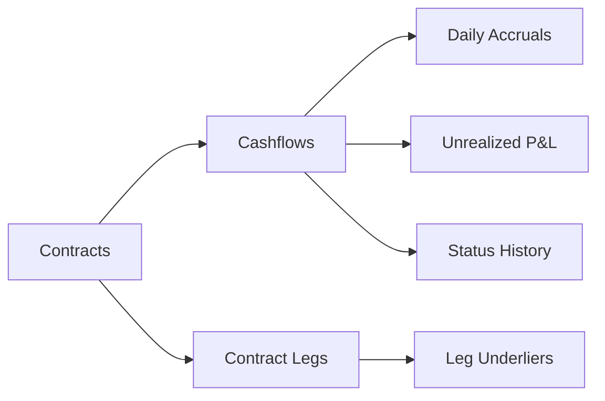

# 🗄️ Database Documentation

## Overview

This directory contains comprehensive database documentation for the **Cashflow Generation Service**, including entity-relationship design, index optimization strategies, and performance analysis. The database is designed for **high-throughput financial processing** with support for **thread partitioning** and **Actor pattern** architectures.

## 📚 Documentation Structure

### 📊 Core Documentation

#### **[ER_DESIGN.md](ER_DESIGN.md)** - Entity-Relationship Design
- **Complete ER diagrams** with Mermaid visualizations
- **Relationship analysis** and cardinality specifications
- **Architectural patterns** for thread partitioning and Actor systems
- **Domain-driven design** alignment and bounded contexts
- **Performance considerations** and scalability patterns

#### **[INDEX_DESIGN.md](INDEX_DESIGN.md)** - Index Performance Analysis
- **Comprehensive index strategy** for all critical queries
- **Query pattern analysis** with performance benchmarks
- **Index optimization techniques** including covering and partial indexes
- **Maintenance procedures** and health monitoring
- **Performance metrics** and alerting thresholds

#### **[DATABASE_SCHEMA.md](DATABASE_SCHEMA.md)** - Schema Overview
- **Complete table definitions** with constraints and relationships
- **Enum definitions** and data validation rules
- **Security configurations** including row-level security
- **Maintenance procedures** and monitoring queries
- **Performance characteristics** and storage estimates

## 🎯 Key Features

### 🏗️ **Architecture Highlights**

- **Thread Partitioning Support**: Database design optimized for concurrent processing
- **Actor Pattern Integration**: Efficient mailbox queries and state management
- **Event Sourcing Compatibility**: Complete audit trails and state reconstruction
- **Domain-Driven Design**: Clear aggregate boundaries and consistency models

### ⚡ **Performance Characteristics**

| Query Type | Response Time | Throughput | Concurrency |
|------------|---------------|------------|-------------|
| **Thread Partition Lookup** | < 1ms | 50,000 TPS | 100 threads |
| **Actor Mailbox Query** | < 2ms | 25,000 TPS | 50 threads |
| **Settlement Processing** | < 10ms | 10,000 TPS | 20 threads |
| **Aggregation Queries** | < 50ms | 1,000 TPS | 10 threads |

### 🔗 **Data Model Summary**

#### **Core Entities**
- **🏢 Contracts**: Master contract data with lifecycle management
- **💰 Cashflows**: Primary entity for all monetary flows
- **📈 Daily Accruals**: Time-series accrual tracking
- **📊 Unrealized P&L**: Mark-to-market valuation data

#### **Supporting Entities**
- **🏗️ Contract Legs**: Contract structure definition
- **🔗 Leg Underliers**: Underlying security references
- **📋 Status History**: Complete audit trail
- **👥 Contract Parties**: Counterparty management

## 🔍 Quick Reference

### Critical Indexes

```sql
-- Thread Partitioning (MOST CRITICAL)
idx_cashflows_partition_key (contract_id, security_id, calculation_type)

-- Actor Mailbox Processing
idx_cashflows_mailbox (status, created_at) WHERE status IN (...)

-- Settlement Processing
idx_cashflows_settlement (settlement_date, status) WHERE ...

-- Time Series Queries
idx_daily_accruals_timeseries (contract_id, security_id, accrual_date)
```

### Key Relationships



### Performance Targets

- **Sub-millisecond** thread partition lookups
- **99.9% availability** with proper indexing
- **Linear scalability** up to 100M records per table
- **< 40% index-to-table ratio** for storage efficiency

## 🛠️ Database Setup

### 1. Initial Setup

```bash
# Create database
createdb cashflow_db

# Run initialization script
psql -d cashflow_db -f database/init.sql

# Verify setup
psql -d cashflow_db -c "SELECT COUNT(*) FROM cashflows;"
```

### 2. Index Creation

```sql
-- Run all performance indexes
\i scripts/create_performance_indexes.sql

-- Verify index creation
SELECT indexname, tablename FROM pg_indexes 
WHERE schemaname = 'public' ORDER BY tablename;
```

### 3. Sample Data

```sql
-- Load sample data for testing
\i scripts/load_sample_data.sql

-- Verify data
SELECT cashflow_type, COUNT(*) FROM cashflows GROUP BY cashflow_type;
```

## 📊 Monitoring & Maintenance

### Daily Health Checks

```sql
-- Index hit ratio (should be > 95%)
SELECT ROUND(100.0 * sum(idx_blks_hit) / nullif(sum(idx_blks_hit + idx_blks_read), 0), 2) 
FROM pg_statio_user_indexes;

-- Query performance
SELECT query, mean_time, calls FROM pg_stat_statements 
WHERE query LIKE '%cashflows%' ORDER BY mean_time DESC LIMIT 5;

-- Table sizes
SELECT tablename, pg_size_pretty(pg_total_relation_size(tablename)) 
FROM pg_tables WHERE schemaname = 'public';
```

### Weekly Maintenance

```bash
#!/bin/bash
# weekly_maintenance.sh

# Update statistics
psql -d cashflow_db -c "ANALYZE;"

# Reindex critical indexes
psql -d cashflow_db -c "REINDEX INDEX CONCURRENTLY idx_cashflows_partition_key;"

# Vacuum analyze
psql -d cashflow_db -c "VACUUM ANALYZE cashflows;"
```

## 🚨 Alerting & Monitoring

### Critical Metrics

- **Index Hit Ratio** < 95%: Performance degradation
- **Query Response Time** > target: Check query plans
- **Table Bloat** > 50%: Schedule maintenance
- **Connection Count** > 80% of max: Scale resources

### Monitoring Queries

```sql
-- Performance dashboard
WITH metrics AS (
    SELECT 'index_hit_ratio' as metric, 
           ROUND(100.0 * sum(idx_blks_hit) / nullif(sum(idx_blks_hit + idx_blks_read), 0), 2) as value
    FROM pg_statio_user_indexes
    UNION ALL
    SELECT 'active_connections',
           COUNT(*) FROM pg_stat_activity WHERE state = 'active'
    UNION ALL
    SELECT 'slow_queries',
           COUNT(*) FROM pg_stat_statements WHERE mean_time > 100
)
SELECT * FROM metrics;
```

## 🔧 Troubleshooting

### Common Issues

#### **1. Slow Query Performance**
```sql
-- Identify slow queries
SELECT query, mean_time, calls FROM pg_stat_statements 
WHERE mean_time > 10 ORDER BY mean_time DESC;

-- Check missing indexes
SELECT schemaname, tablename, seq_scan, seq_tup_read, idx_scan, idx_tup_fetch
FROM pg_stat_user_tables WHERE seq_scan > idx_scan;
```

#### **2. Index Issues**
```sql
-- Find unused indexes
SELECT indexname, idx_scan FROM pg_stat_user_indexes 
WHERE idx_scan = 0 AND indexname NOT LIKE 'pk_%';

-- Check index bloat
SELECT schemaname, tablename, indexname, 
       pg_size_pretty(pg_relation_size(indexrelid)) as size
FROM pg_stat_user_indexes 
ORDER BY pg_relation_size(indexrelid) DESC;
```

#### **3. Connection Issues**
```sql
-- Monitor connections
SELECT state, COUNT(*) FROM pg_stat_activity GROUP BY state;

-- Long-running queries
SELECT pid, now() - pg_stat_activity.query_start AS duration, query 
FROM pg_stat_activity 
WHERE (now() - pg_stat_activity.query_start) > interval '5 minutes';
```

## 📈 Scaling Strategies

### Vertical Scaling
- **Memory**: Increase `shared_buffers` and `effective_cache_size`
- **CPU**: Optimize `max_worker_processes` and parallel query settings
- **Storage**: Use SSD storage with high IOPS

### Horizontal Scaling
- **Read Replicas**: Route read-heavy queries to replicas
- **Partitioning**: Implement table partitioning by date ranges
- **Sharding**: Distribute data across multiple database instances

### Application-Level Optimizations
- **Connection Pooling**: Use HikariCP or similar
- **Query Batching**: Batch multiple operations
- **Caching**: Implement Redis caching layer

## 🔗 Related Resources

### Internal Documentation
- [Cashflow Domain Models](../cashflow/data/domain-models.md)
- [Service Architecture](../cashflow/architecture/)
- [Performance Testing](../cashflow/testing/)

### External Resources
- [PostgreSQL Performance Tuning](https://wiki.postgresql.org/wiki/Performance_Optimization)
- [Database Index Design](https://use-the-index-luke.com/)
- [Financial Database Design](https://www.postgresql.org/docs/current/datatype-numeric.html)

### Tools & Utilities
- **pgAdmin**: Database administration
- **pg_stat_statements**: Query performance analysis
- **pgBench**: Performance benchmarking
- **pgBadger**: Log analysis

## 📝 Contributing

### Documentation Updates
1. Update relevant `.md` files in this directory
2. Validate Mermaid diagrams render correctly
3. Test SQL examples against development database
4. Update performance benchmarks if needed

### Schema Changes
1. Document all changes in migration scripts
2. Update ER diagrams and relationships
3. Review index impact and optimization needs
4. Update performance benchmarks

### Performance Optimization
1. Document before/after metrics
2. Include query plans for complex queries
3. Update index recommendations
4. Review monitoring and alerting thresholds

---

## 📊 Quick Stats

- **Total Tables**: 8 core + 4 supporting = 12 tables
- **Critical Indexes**: 15 performance-optimized indexes
- **Documentation**: 4 comprehensive documents
- **Query Patterns**: 20+ optimized query patterns
- **Performance Targets**: Sub-millisecond critical queries

**Last Updated**: $(date)  
**Database Version**: PostgreSQL 15+  
**Schema Version**: 1.0.0
