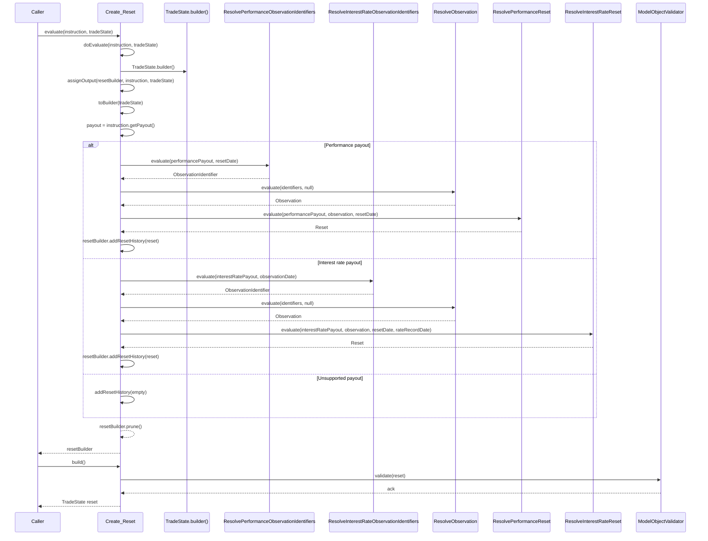

## Create_Reset Java Call Flow

The diagram below traces the generated Java implementation in `cdm/event/common/functions/c`. It highlights how the Rosetta function evaluates a reset instruction and delegates to helper functions for observation and reset resolution.

### Notes
- Branching is driven by the payout type referenced by the `ResetInstruction`.
- Both branches rely on `ResolveObservation` to pull market data after identifiers are computed.
- `ModelObjectValidator` runs after the builder is converted back to an immutable `TradeState`, enforcing schema constraints before the result is returned.

