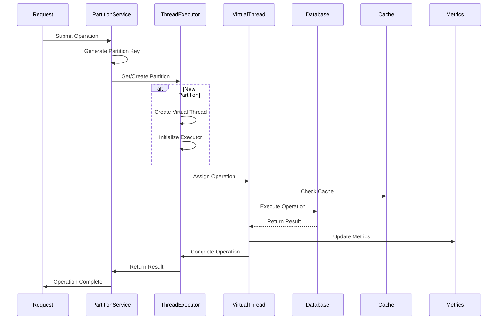

# Data Flow Diagrams

## Overview

This document provides comprehensive data flow diagrams for the Cash Flow Generation Service, illustrating the various processing workflows, thread partitioning strategies, and reactive processing patterns.

## Cashflow Generation Flow

### **1. High-Level Cashflow Generation Process**

### **2. Detailed Cashflow Generation Flow**

## Thread Partitioning Flow

### **1. Partition Key Generation and Assignment**

### **2. Partition Execution Flow**

## Interest Calculation Flow

### **1. Daily Interest Accrual Process**

### **2. Interest Rate Reset Process**

## Equity Calculation Flow

### **1. Market Data Update Process**

### **2. End-of-Day Valuation Process**

## Reactive Processing Flow

### **1. High-Volume Batch Processing**

### **2. Real-Time Stream Processing**

## State Transition Flow

### **1. Cashflow Lifecycle State Machine**

### **2. State Transition Process**

## Error Handling Flow

### **1. Partition Error Recovery**

### **2. Error Notification Flow**

## Performance Monitoring Flow

### **1. Metrics Collection Process**

### **2. Health Check Flow**

## Data Integration Flow

### **1. External Service Integration**

### **2. Event Publishing Flow**

## Summary of Data Flows

### **1. Primary Processing Flows**
- **Cashflow Generation**: Client request → Partition assignment → Calculation → Storage → Event publishing
- **Interest Accrual**: Scheduled job → Partition creation → Daily calculation → Cumulative updates
- **Equity Valuation**: Market data → Partition processing → P&L calculation → Status updates
- **State Transitions**: State change request → Validation → Partition execution → Event publishing

### **2. Reactive Processing Patterns**
- **Batch Processing**: High-volume operations with backpressure handling
- **Stream Processing**: Real-time updates with reactive streams
- **Error Handling**: Comprehensive error handling with circuit breakers
- **Performance Monitoring**: Real-time metrics collection and health checks

### **3. Thread Partitioning Benefits**
- **Data Consistency**: ACID operations within partitions
- **High Concurrency**: Multiple partitions processing simultaneously
- **Fault Isolation**: Errors contained within partitions
- **Scalability**: Easy horizontal scaling across instances

---

**Next Steps**:
1. Review [Implementation Guide](../implementation/service-implementation.md)
2. Explore [Business Logic](../business/calculation-engines.md)
3. Understand [Deployment Strategy](../deployment/deployment-architecture.md)
4. Review [Performance Tuning](../deployment/performance-tuning.md)
