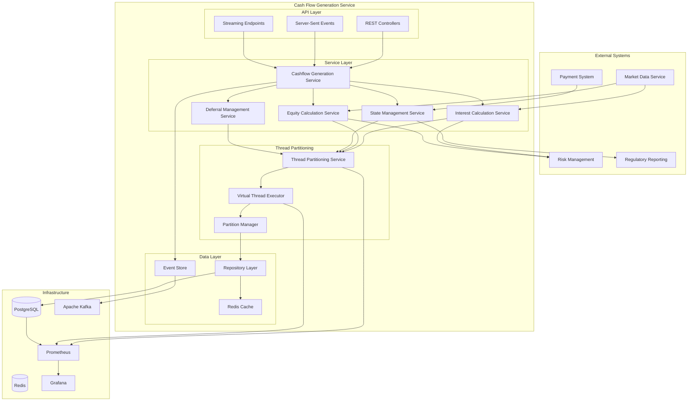
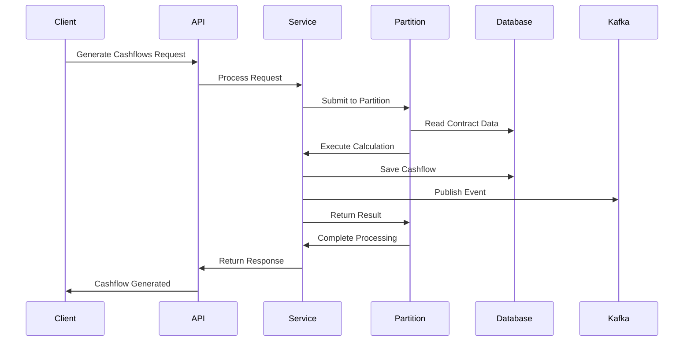
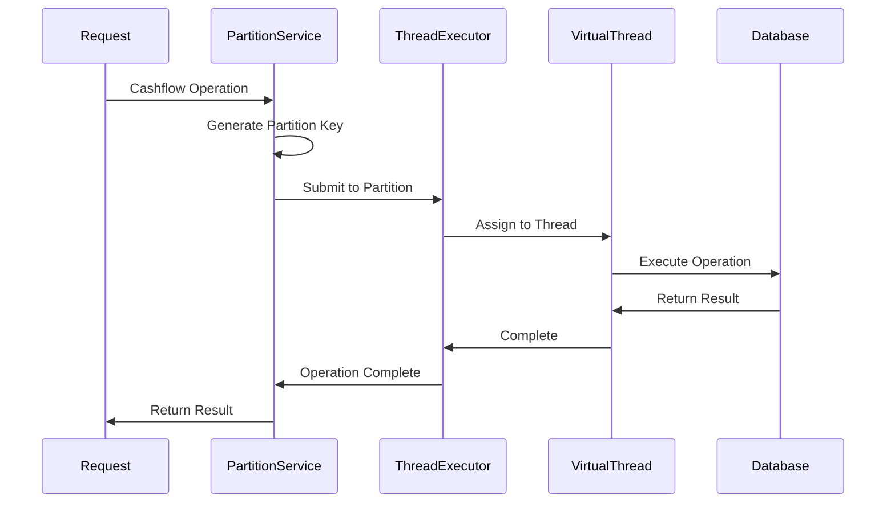

# Cash Flow Generation Service - System Architecture

## Overview

The **Cash Flow Generation Service** is designed as a high-performance, scalable microservice that leverages Java 21 virtual threads and Spring Boot 3.3+ reactive capabilities to handle high-volume cashflow processing with strict data consistency guarantees.

## Architecture Principles

### **1. Thread Partitioning Strategy**
- **Partition Key**: `ContractId + SecurityId (Underlier) + CalculationType`
- **Isolation Guarantee**: All operations for the same partition run in the same thread
- **Data Consistency**: ACID operations within partitions, preventing race conditions
- **Scalability**: Horizontal scaling across multiple service instances

### **2. Reactive Programming Model**
- **Non-blocking I/O**: Spring WebFlux for reactive REST APIs
- **Reactive Streams**: Project Reactor for high-volume processing
- **Backpressure Handling**: Automatic flow control for varying load
- **Event-Driven**: Kafka-based event streaming for system integration

### **3. Calculation Type Separation**
- **Interest Calculations**: Daily accruals with rate management
- **Equity Calculations**: P&L and dividend processing
- **Independent Processing**: No interference between calculation types
- **Different Frequencies**: Batch vs. event-driven processing

## High-Level Architecture



## Component Architecture

### **1. API Layer (Spring WebFlux)**

#### **REST Controllers**
- **`CashflowController`**: Main cashflow CRUD operations
- **`InterestCalculationController`**: Interest-specific endpoints
- **`EquityCalculationController`**: Equity-specific endpoints
- **`ThreadPartitionController`**: Partition monitoring and management

#### **Reactive Endpoints**
- **Streaming Responses**: Real-time cashflow generation updates
- **Server-Sent Events**: Live processing status updates
- **Backpressure Handling**: Automatic flow control for high volumes

### **2. Service Layer**

#### **Core Services**
```java
@Service
public class CashflowGenerationService {
    // Orchestrates cashflow generation across different types
    // Manages thread partitioning and coordination
}

@Service
public class InterestCalculationService {
    // Handles interest accruals and calculations
    // Runs in INTEREST thread partitions
}

@Service
public class EquityCalculationService {
    // Handles equity P&L and dividend calculations
    // Runs in EQUITY thread partitions
}
```

#### **State Management**
```java
@Service
public class CashflowStateManagementService {
    // Manages cashflow lifecycle state transitions
    // Ensures thread-safe state changes within partitions
}

@Service
public class DeferralManagementService {
    // Handles cashflow deferrals and business rules
    // Manages deferral reasons and periods
}
```

### **3. Thread Partitioning Layer**

#### **Partition Strategy**
```java
public record ThreadPartitionKey(
    UUID contractId,
    String securityId,
    CalculationType calculationType
) {
    // Ensures thread isolation per contract + underlier + calculation type
}

public enum CalculationType {
    INTEREST,   // Interest accruals and calculations
    EQUITY      // Equity P&L and dividend calculations
}
```

#### **Virtual Thread Executor**
```java
@Configuration
public class PartitionedVirtualThreadExecutor {
    // Manages virtual threads with partition-based isolation
    // Handles thread allocation and load balancing
    // Provides monitoring and metrics
}
```

### **4. Data Layer**

#### **Repository Pattern**
```java
@Repository
public interface CashflowRepository extends ReactiveCrudRepository<Cashflow, UUID> {
    // Reactive database operations
    // Partition-aware queries
    // Optimized for high-volume operations
}
```

#### **Caching Strategy**
```java
@Service
public class CashflowCacheService {
    // Redis-based caching for frequently accessed data
    // Market data caching for calculations
    // Partition-aware cache keys
}
```

## Data Flow Architecture

### **1. Cashflow Generation Flow**



### **2. Thread Partitioning Flow**



## Scalability Architecture

### **1. Horizontal Scaling**

#### **Service Instance Scaling**
- **Multiple Instances**: Deploy across multiple nodes
- **Load Balancing**: Distribute requests across instances
- **Partition Distribution**: Spread partitions across instances
- **Health Checks**: Automatic instance health monitoring

#### **Database Scaling**
- **Read Replicas**: Separate read and write operations
- **Partitioning**: Database-level partitioning by date/contract
- **Connection Pooling**: Efficient connection management
- **Sharding**: Distribute data across multiple databases

### **2. Vertical Scaling**

#### **Resource Optimization**
- **Virtual Threads**: Efficient memory usage
- **CPU Optimization**: Parallel processing within partitions
- **Memory Management**: Optimized object pooling
- **I/O Optimization**: Non-blocking operations

## Security Architecture

### **1. Authentication & Authorization**
- **OAuth 2.0**: Secure API authentication
- **JWT Tokens**: Stateless authentication
- **Role-Based Access Control**: Fine-grained permissions
- **API Keys**: Service-to-service authentication

### **2. Data Protection**
- **Encryption**: Data at rest and in transit
- **Audit Logging**: Complete operation audit trail
- **Data Masking**: Sensitive data protection
- **Access Controls**: Database-level security

## Monitoring & Observability

### **1. Metrics Collection**
- **Spring Boot Actuator**: Built-in health checks and metrics
- **Custom Metrics**: Business-specific measurements
- **Thread Partition Metrics**: Partition utilization and performance
- **Performance Metrics**: Throughput, latency, error rates

### **2. Logging & Tracing**
- **Structured Logging**: JSON-formatted logs
- **Request Tracing**: End-to-end request tracking
- **Partition Logging**: Thread partition activity logs
- **Error Logging**: Comprehensive error tracking

### **3. Alerting**
- **Performance Alerts**: Response time and throughput thresholds
- **Error Rate Alerts**: Error rate monitoring
- **Partition Alerts**: Partition overload and failure alerts
- **Resource Alerts**: Memory and CPU utilization alerts

## Performance Characteristics

### **1. Throughput Targets**
- **Baseline**: 10,000 cashflows per minute
- **Target**: 50,000 cashflows per minute
- **Peak**: 100,000 cashflows per minute
- **Sustained**: 25,000 cashflows per minute

### **2. Response Time Targets**
- **API Response**: <100ms (95th percentile)
- **Batch Processing**: <5 minutes for 10,000 cashflows
- **Real-time Updates**: <50ms for status changes
- **Database Queries**: <10ms for indexed queries

### **3. Concurrency Targets**
- **Virtual Threads**: 100,000+ concurrent operations
- **Partition Capacity**: 1,000 operations per partition
- **Service Instances**: 5-10 instances for high availability
- **Database Connections**: 100-200 concurrent connections

## Deployment Architecture

### **1. Container Strategy**
- **Docker**: Lightweight containerization
- **Multi-stage Builds**: Optimized image sizes
- **Health Checks**: Container health monitoring
- **Resource Limits**: CPU and memory constraints

### **2. Orchestration**
- **Kubernetes**: Container orchestration
- **Helm Charts**: Deployment templates
- **Auto-scaling**: Horizontal pod auto-scaling
- **Service Mesh**: Istio for service-to-service communication

### **3. Environment Strategy**
- **Development**: Local development with Docker Compose
- **Staging**: Full environment for testing
- **Production**: High-availability production deployment
- **Disaster Recovery**: Multi-region deployment strategy

## Integration Architecture

### **1. Event-Driven Integration**
- **Kafka Topics**: Cashflow events and status updates
- **Event Schema**: Standardized event definitions
- **Event Routing**: Topic-based event distribution
- **Event Sourcing**: Complete audit trail maintenance

### **2. Synchronous Integration**
- **REST APIs**: Standard HTTP-based integration
- **GraphQL**: Flexible data querying
- **Webhooks**: Real-time notifications
- **Health Checks**: Service health monitoring

### **3. Data Integration**
- **Database Synchronization**: Real-time data updates
- **Cache Invalidation**: Distributed cache management
- **Data Replication**: Multi-region data synchronization
- **Backup & Recovery**: Automated backup strategies

## Error Handling & Resilience

### **1. Circuit Breaker Pattern**
- **External Service Calls**: Market data and payment systems
- **Fallback Strategies**: Graceful degradation
- **Retry Mechanisms**: Exponential backoff
- **Timeout Handling**: Configurable timeouts

### **2. Fault Tolerance**
- **Partition Isolation**: Failures isolated to partitions
- **Graceful Degradation**: Service continues with reduced functionality
- **Automatic Recovery**: Self-healing mechanisms
- **Data Consistency**: ACID guarantees maintained

### **3. Monitoring & Alerting**
- **Error Tracking**: Comprehensive error logging
- **Performance Monitoring**: Real-time performance metrics
- **Alert Escalation**: Automated alert routing
- **Incident Response**: Defined response procedures

---

**Next Steps**:
1. Review [Thread Partitioning Strategy](thread-partitioning.md)
2. Explore [Reactive Architecture](reactive-architecture.md)
3. Understand [Data Flow Diagrams](data-flow-diagrams.md)
4. Review [Implementation Guide](../implementation/service-implementation.md)
