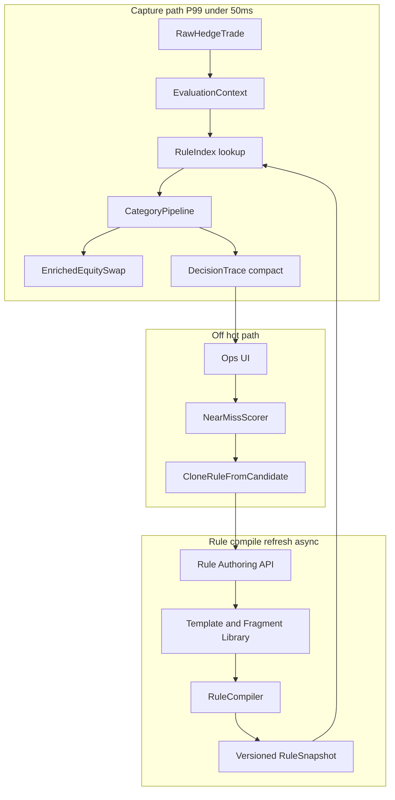
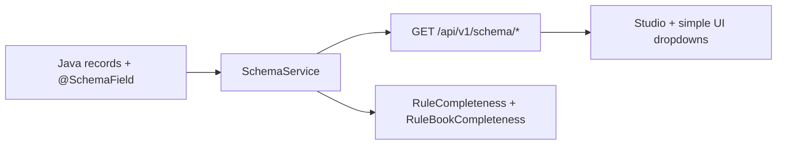

# Equity Swap Enrichment Rules Engine (Greenfield)

## Context and goals

You need a rules engine that turns a **raw hedge trade** into a **fully enriched equity swap** (swap contract, interest leg, equity leg, schedule, dividend passthrough, workflow/routing) with:


| Requirement                                                               | Design response                                                           |
| ------------------------------------------------------------------------- | ------------------------------------------------------------------------- |
| Category-specific behavior (economic vs non-economic vs workflow/routing) | Pluggable **evaluation strategies** per `RuleCategory`                    |
| Economic: restrictive-first, layered enrichment per attribute             | **Attribute-scoped rule buckets** + `LayeredEnrichmentStrategy`           |
| Non-economic / workflow: most restrictive **first match**                 | `FirstMatchExclusiveStrategy` per **domain** (legal, docs, routing, etc.) |
| Explainability                                                            | Immutable **decision trace** on every applied change                      |
| No match → closest match + template rule                                  | **Off hot path**: near-miss scoring API + rule cloning from template      |
| No duplication                                                            | **Templates + criteria fragments + composition** (not copy-paste rules)   |
| ~1M trades/day, P99 < 50ms sync                                           | Compile-time indexing, zero reflection on hot path, bounded trace         |


**Baseline to learn from (not extend):** `pb-synth-tradecapture-svc` (sibling repo) already has compiled snapshots, weight ordering, and `DATAPRODUCT` JSONPath actions — but applies **all matching rules** in one loop and stores only a string list in `rulesApplied`. The greenfield engine should preserve the performance ideas (compile + cache) while fixing semantics and provenance.

---

## Recommended architecture

### High-level flow




### Core domain model (separate `rules-engine-core` library)

1. `**EnrichmentTarget**` — logical slice of the swap (not just rule type):
  - `SWAP_CONTRACT`, `INTEREST_LEG`, `EQUITY_LEG`, `SCHEDULE`, `DIV_PASSTHROUGH`, `LEGAL_ENTITY`, `WORKFLOW`, `ROUTING`, etc.
2. `**RuleCategory**` — drives evaluation strategy:
  - `ECONOMIC`, `NON_ECONOMIC`, `BUSINESS`, `WORKFLOW`, `ROUTING`, `VALIDATION`
3. `**RuleDefinition**` — match + apply metadata:
  - `id`, `version`, `effectiveDate`, `enabled`
  - `criteria` (references **CriteriaFragment** IDs or inline)
  - `actions` (references **ActionTemplate** IDs or inline overrides)
  - `target`: `EnrichmentTarget`
  - `specificity`: optional override; else **computed at compile time**
  - `evaluationMode`: `LAYERED` | `FIRST_MATCH` | `ALL_MATCH` (default derived from category)
4. `**ActionTemplate`** — reusable transformation bundle (answers “should I group rules in subcategories?” **yes**):
  - Example: `USD_ACT360_INTEREST_LEG`, `STANDARD_DIV_PASSTHROUGH_85`, `EQUITY_SWAP_SCHEDULE_MONTHLY`
  - Rules only add **criteria** + small deltas (`parameters`, `overrides`)
5. `**CriteriaFragment`** — reusable predicates (e.g. `BOOK_EQ_SWAP`, `CCY_USD`, `CLIENT_TIER_1`)

**Composition example (no duplication):**

```json
{
  "id": "ECON_SWAP_USD_INTEREST_V3",
  "category": "ECONOMIC",
  "target": "INTEREST_LEG",
  "includes": ["FRAG_EQ_SWAP_BOOK", "FRAG_CCY_USD"],
  "apply": ["TMPL_USD_FLOAT_ACT360"],
  "overrides": { "spreadBps": 25 }
}
```

At compile time, `includes` + `apply` are **flattened** into one `CompiledRule` — zero runtime composition cost.

---

## Evaluation strategies (category behavior)

Implement as strategy registry keyed by `(RuleCategory, EnrichmentTarget)` with safe defaults:


| Category                       | Default strategy              | Semantics                                                                                                                                                                                                                                                      |
| ------------------------------ | ----------------------------- | -------------------------------------------------------------------------------------------------------------------------------------------------------------------------------------------------------------------------------------------------------------- |
| **ECONOMIC**                   | `LayeredEnrichmentStrategy`   | For each **attribute path** (e.g. `interestLeg.dayCount`, `equityLeg.returnType`), evaluate all rules whose actions touch that path; sort by **specificity desc**; apply in order; **later rule may only fill nulls** unless `overridePolicy=ALWAYS` on action |
| **NON_ECONOMIC**, **BUSINESS** | `FirstMatchExclusiveStrategy` | Per `EnrichmentTarget` domain, pick **single** winning rule: highest specificity among matches; stop                                                                                                                                                           |
| **WORKFLOW**, **ROUTING**      | `FirstMatchExclusiveStrategy` | Same; optional `stopOnMatch=true` globally                                                                                                                                                                                                                     |
| **VALIDATION**                 | `AllMatchCollectStrategy`     | Collect violations; do not mutate (or soft vs hard flags)                                                                                                                                                                                                      |


### Specificity (“restrictiveness”) — computed, not guessed

At compile time, score each rule (store on `CompiledRule`):

```
specificity = w1 * criteriaCount
            + w2 * operatorSelectivity(operator)
            + w3 * inverseCardinality(estimatedMatchRate)  // from ops stats or manual tag
            + explicitSpecificityBoost
```

- `EQ` on book + client + currency > `IN` on region > broad `EXISTS`
- Sort **descending** for “most restrictive first”
- Tie-break: `priority` asc, then `ruleId` (stable)

**Important correction vs current svc:** For economic, **do not** apply all rules blindly in weight order across unrelated attributes — that causes accidental overrides (see `pb-synth-tradecapture-svc/docs/rules-weightage-guide.md` Scenario 1). Group by **target attribute path** first, then apply restrictive → permissive within that path only.

### Phased enrichment pipeline (swap shape)

Run categories in a fixed pipeline (dependencies explicit):


Within each phase, only invoke indexes for relevant `EnrichmentTarget`s present in the trade profile (product type = equity swap).

---

## Explainability (first-class)

Replace string-only `rulesApplied` with structured `**DecisionTrace**`:

```json
{
  "tradeId": "...",
  "snapshotVersion": "2026-05-23T12:00:00Z",
  "decisions": [
    {
      "seq": 1,
      "ruleId": "ECON_SWAP_USD_INTEREST_V3",
      "ruleVersion": 3,
      "category": "ECONOMIC",
      "target": "INTEREST_LEG",
      "strategy": "LAYERED",
      "specificity": 87.5,
      "matchedCriteria": ["FRAG_EQ_SWAP_BOOK", "FRAG_CCY_USD"],
      "actions": ["TMPL_USD_FLOAT_ACT360"],
      "paths": ["$.swap.interestLeg.dayCount"],
      "before": "ACT/360",
      "after": "ACT/365",
      "reason": "More specific USD equity swap interest rule"
    }
  ],
  "unresolved": [
    { "target": "DIV_PASSTHROUGH", "path": "$.swap.divPassthrough.percent", "status": "NO_MATCH" }
  ]
}
```

**Hot path constraints (P99 < 50ms):**

- Record **only** paths touched (not full swap JSON diff)
- Use pre-interned strings for rule/template IDs
- Cap trace entries (e.g. 64) with overflow flag
- Persist full trace **asynchronously** to object store / DB for UI; return trace ID on API response

**UI narrative:** Generate human text from trace offline (“Rule X set day count to ACT/365 because book=EQ_SWAP and currency=USD”).

---

## Closest match and rule authoring (cold path only)

When `unresolved` contains `NO_MATCH` for a target:

1. `**POST /rules/near-miss`** (not on capture path): score all rules in that target bucket:
  - `score = matchedCriteria / totalCriteria` (weighted by fragment importance)
  - Return top 5 with **missingCriteria** list
2. `**POST /rules/from-candidate`**: clone winning near-miss → new draft rule:
  - Copy `apply` templates
  - Auto-add criteria from trade context for fields that differ
  - Set `effectiveDate` in future; `status=DRAFT`
3. **Simulation**: `POST /rules/simulate` replays trade against draft before publish

Never run near-miss scoring inside synchronous `enrich(trade)`.

---

## Performance design (~1M/day, P99 < 50ms)

**Load profile:** ~12 trades/sec average; plan for **100–300 trades/sec** peak bursts.


| Technique                                                | Purpose                                                                                                                                                         |
| -------------------------------------------------------- | --------------------------------------------------------------------------------------------------------------------------------------------------------------- |
| **Versioned `RuleSnapshot`** in memory (per env)         | No DB on hot path                                                                                                                                               |
| `**RuleCompiler**` on publish                            | Flatten templates, compile predicates, compute specificity, build indexes                                                                                       |
| **Inverted index** on leading dimensions                 | `productType`, `book`, `currency`, `clientTier` → candidate rule IDs                                                                                            |
| **Attribute-path buckets** for economic                  | Avoid scanning all economic rules                                                                                                                               |
| **Compiled predicates** (`Predicate<EvaluationContext>`) | No reflection / JSONPath parse at runtime                                                                                                                       |
| **Object pooling** for `EvaluationContext`               | Reduce GC in burst                                                                                                                                              |
| **Immutable swap builder**                               | Structural sharing; copy-on-write per leg                                                                                                                       |
| **Parallelism**                                          | Limited: pipeline phases are sequential; parallelize only **independent** reference-data prefetches before rules (security/account), not rule evaluation itself |
| **Publish invalidation**                                 | Blue/green snapshot swap via atomic reference                                                                                                                   |


**Budget (indicative):** index lookup ~1ms, economic layered apply ~15–25ms, other categories ~5–10ms, trace write ~2–5ms → headroom for 50ms P99 with profiling gates in CI.

**What to avoid on hot path:** Drools full Rete (heavy startup), runtime JSONPath parse, near-miss scoring, DB rule fetch, deep clone of entire swap.

---

## Service boundaries (greenfield modules)


| Module                    | Responsibility                                                                                     |
| ------------------------- | -------------------------------------------------------------------------------------------------- |
| `**swap-rules-core`**     | Models, strategies, compiler, snapshot, trace                                                      |
| `**swap-rules-runtime**`  | `EnrichmentEngine.enrich(ctx)` — hot path                                                          |
| `**swap-rules-admin**`    | CRUD, templates/fragments, publish, simulate, near-miss                                            |
| `**swap-rules-store**`    | Postgres (definitions), Redis (optional snapshot broadcast)                                        |
| **Trade capture service** | Builds `EvaluationContext` from raw hedge + reference data; calls runtime; persists swap + traceId |


---

## Rule authoring and governance

- **Lifecycle:** `DRAFT` → `SIMULATED` → `APPROVED` → `PUBLISHED` (immutable version)
- **Effective dating:** same rule `id`, monotonic `version`, `effectiveFrom`
- **Conflict detection at publish:** two rules same target + overlapping criteria + same specificity → block or warn
- **Impact analysis:** replay last N days sample trades in admin (batch job) before publish

Extend schema beyond `pb-synth-tradecapture-svc/docs/rule-configuration-schema.json`: add `templates`, `fragments`, `targets`, `evaluationMode`, `overridePolicy`.

---

## Mapping to equity swap artifacts

Use **target-centric** rules (not one giant rule):


| EnrichmentTarget  | Typical templates                    | Category                |
| ----------------- | ------------------------------------ | ----------------------- |
| `SWAP_CONTRACT`   | identifiers, product type, start/end | ECONOMIC + NON_ECONOMIC |
| `INTEREST_LEG`    | float/fix, index, spread, day count  | ECONOMIC                |
| `EQUITY_LEG`      | return type, fee, notional adjust    | ECONOMIC                |
| `SCHEDULE`        | payment frequency, roll conventions  | ECONOMIC                |
| `DIV_PASSTHROUGH` | pct, timing, ex-date handling        | ECONOMIC                |
| `WORKFLOW`        | auto vs manual approval              | WORKFLOW                |
| `ROUTING`         | downstream topic/queue/system        | ROUTING                 |


This subcategorization **is** the reuse layer — templates are the shared subcategories you asked about.

---

## Migration from existing trade capture (later)

When integrating (post-greenfield):

1. Port high-value `DATAPRODUCT` JSONPath actions into **ActionTemplates** with compiled setters.
2. Map `RuleType` → `RuleCategory` + `EnrichmentTarget`.
3. Run **shadow mode**: old engine vs new engine, diff swap + trace.
4. Cut over per product/book slice.

---

## Success metrics

- **Correctness:** golden trade fixtures per target; property tests for “restrictive wins” per attribute
- **Performance:** JMH / load test — P99 < 50ms @ 200 TPS with production-sized rule set (e.g. 2–5k compiled rules, 200 templates)
- **Ops:** mean time to create rule from near-miss < 5 minutes
- **Explainability:** 100% of mutated paths have trace entries

---

## Technology stack

Chosen to (a) hit P99 < 50ms on the JVM, (b) match the existing ecosystem so the trade capture team can integrate later, and (c) keep the hot path lean.

| Layer | Choice | Why |
|-------|--------|-----|
| Language | **Java 21 (LTS)** | Records, sealed interfaces (typed strategies), pattern matching, virtual threads for ref-data fan-out, mature JIT |
| Framework | **Spring Boot 3.3+** | Matches existing svc; actuator, validation, web, data — but core engine stays POJO/no-Spring for portability |
| Build | **Maven multi-module** | Matches existing `pb-synth-tradecapture-svc` (`pom.xml`); easier internal mirror publish |
| Rule predicates | **Hand-rolled compiled `Predicate<EvaluationContext>`** | Drools Rete adds startup + memory + ops complexity not justified at our rule volume; we already need attribute-bucketing |
| Field access | **MethodHandles + precompiled accessors** (built once at compile) | Beats reflection 5–10x; falls back to JSONPath only for admin tooling |
| In-memory caches | **Caffeine** | Snapshot ref, near-miss memoization |
| Primitive collections | **Eclipse Collections** (or fastutil) | Hot-path int/long maps without boxing |
| JSON | **Jackson 2 + records** | Rule definitions, trace serialization |
| Mapping raw→context | **MapStruct** | Compile-time, zero-reflection |
| Validation | **Jakarta Bean Validation (Hibernate Validator)** | Rule admin validation |
| Persistence (admin) | **PostgreSQL 16 + JSONB**, **Flyway** migrations, **Spring Data JPA** + **jOOQ** for complex queries | Matches existing svc; JSONB for criteria/actions; deterministic migrations |
| Snapshot broadcast | **Redis Pub/Sub** + `AtomicReference<RuleSnapshot>` per instance | Multi-instance publish notification; hot path stays in-process |
| Trace store | **Kafka topic `swap.enrichment.trace`** → **S3/Blob** via sink, plus **OpenSearch** for query UI | Async, never blocks capture path |
| Messaging | **Kafka** primary, **Solace** adapter pluggable | Matches existing svc choices |
| API | **Spring Web** (admin) + **OpenAPI 3 via springdoc** | Standard; generates UI clients |
| Internal call (capture → runtime) | **In-process library call** (not gRPC) | Runtime is a JAR consumed by capture svc — eliminates network hop from hot path |
| Metrics | **Micrometer + Prometheus** | Aligns with existing roadmap doc |
| Tracing | **OpenTelemetry (auto + manual spans for each pipeline phase)** | Per-phase latency visibility |
| Logging | **SLF4J + Logback JSON encoder + MDC** (`tradeId`, `snapshotVersion`) | Aligns with existing roadmap |
| Testing | **JUnit 5, AssertJ, jqwik (property tests), Testcontainers (PG/Redis/Kafka), ArchUnit (module boundaries), JMH (micro-bench), Gatling (load)** | Each addresses a real risk |
| Build/Deploy | **Docker (distroless-java21)**, **Kubernetes** with HPA on CPU + Kafka lag | Standard |
| Profiling in prod | **JFR continuous + async-profiler on demand** | Required to maintain P99 SLO |

**Explicit non-choices and rationale:**
- ❌ Drools / KIE — Rete overhead + ops cost, weak fit for attribute-bucketed layered enrichment
- ❌ Kotlin DSL for rules — rules are data (DB/JSON), not code; avoids redeploys to change rules
- ❌ GraalVM native — JIT + warmup is fine at our TPS and gives better steady-state throughput
- ❌ gRPC between capture and runtime — adds 1–3ms hop we don't need; library call is faster and simpler

---

## Module layout (Maven multi-module)

```
swap-rules-engine/                 (parent pom)
├── swap-rules-core/               (pure Java, no Spring)
│   ├── model/                     (records: RuleDefinition, ActionTemplate, ...)
│   ├── compile/                   (RuleCompiler, SpecificityScorer, IndexBuilder)
│   ├── snapshot/                  (RuleSnapshot, AtomicReference holder)
│   ├── strategy/                  (sealed EvaluationStrategy + impls)
│   ├── trace/                     (DecisionTrace, BoundedTraceBuffer)
│   └── api/                       (EnrichmentEngine interface)
├── swap-rules-runtime/            (engine impl, Spring optional)
│   ├── engine/                    (EnrichmentEngineImpl)
│   ├── context/                   (EvaluationContext + pool)
│   ├── builder/                   (EquitySwapBuilder copy-on-write)
│   └── observability/             (Micrometer wiring)
├── swap-rules-store/              (Spring Data JPA + Flyway)
│   ├── entity/                    (RuleEntity, TemplateEntity, FragmentEntity)
│   ├── repo/
│   └── migration/                 (V1__init.sql, V2__templates.sql, ...)
├── swap-rules-admin/              (Spring Boot app: REST API)
│   ├── controller/                (RulesController, TemplatesController, NearMissController, SimulationController)
│   ├── service/                   (PublishService with conflict detection)
│   └── narrative/                 (DecisionTrace → human text)
├── swap-rules-shadow/             (replay + diff lib, optional)
├── swap-rules-jmh/                (JMH benchmarks)
└── swap-rules-loadtest/           (Gatling scenarios)
```

**Boundary enforcement** via ArchUnit test: `swap-rules-core` must not depend on Spring; `swap-rules-runtime` must not depend on `swap-rules-store` or `swap-rules-admin`.

---

## Data model (Postgres DDL sketch)

```sql
CREATE TABLE rule_definition (
  id              VARCHAR(64)  NOT NULL,
  version         INT          NOT NULL,
  category        VARCHAR(20)  NOT NULL,
  target          VARCHAR(30)  NOT NULL,
  effective_from  DATE         NOT NULL,
  effective_to    DATE,
  enabled         BOOLEAN      NOT NULL DEFAULT TRUE,
  evaluation_mode VARCHAR(20),
  specificity_boost NUMERIC(6,2) DEFAULT 0,
  body            JSONB        NOT NULL,   -- criteria, actions, includes, apply, overrides
  status          VARCHAR(20)  NOT NULL,   -- DRAFT/SIMULATED/APPROVED/PUBLISHED
  created_by      VARCHAR(64),
  created_at      TIMESTAMPTZ  NOT NULL DEFAULT now(),
  PRIMARY KEY (id, version)
);
CREATE INDEX ix_rule_cat_tgt_eff ON rule_definition (category, target, effective_from);
CREATE INDEX ix_rule_body_gin ON rule_definition USING GIN (body jsonb_path_ops);

CREATE TABLE action_template (
  id VARCHAR(64) PRIMARY KEY, version INT NOT NULL,
  target VARCHAR(30) NOT NULL, body JSONB NOT NULL,
  status VARCHAR(20) NOT NULL
);

CREATE TABLE criteria_fragment (
  id VARCHAR(64) PRIMARY KEY, version INT NOT NULL,
  body JSONB NOT NULL, status VARCHAR(20) NOT NULL
);

CREATE TABLE snapshot_publication (
  snapshot_id  UUID PRIMARY KEY,
  published_at TIMESTAMPTZ NOT NULL DEFAULT now(),
  rule_count   INT, template_count INT, fragment_count INT,
  checksum     VARCHAR(64)
);
```

Trace lives in Kafka, not Postgres — keep OLTP small.

---

## Hot path: key code shapes

Sealed strategy hierarchy (no `instanceof` chains, JIT-friendly):

```java
public sealed interface EvaluationStrategy
    permits LayeredEnrichmentStrategy, FirstMatchExclusiveStrategy, AllMatchCollectStrategy {
  void apply(TargetBucket bucket, EvaluationContext ctx, EquitySwapBuilder out, TraceSink trace);
}
```

`EnrichmentEngine` shape:

```java
public final class EnrichmentEngineImpl implements EnrichmentEngine {
  private final AtomicReference<RuleSnapshot> snapshotRef;
  private final List<PhaseDescriptor> pipeline;       // ordered phases
  private final ContextPool ctxPool;
  private final TraceSink traceSink;                  // Kafka async

  public EnrichmentResult enrich(RawHedgeTrade raw) {
    var snap = snapshotRef.get();
    var ctx  = ctxPool.acquire().bind(raw, snap);
    var out  = EquitySwapBuilder.startFrom(raw);
    var trace= new BoundedTrace(snap.version());
    try {
      for (var phase : pipeline) {
        var bucket = snap.bucketFor(phase.category(), phase.target(), ctx);
        phase.strategy().apply(bucket, ctx, out, trace);
      }
      traceSink.publishAsync(trace);
      return new EnrichmentResult(out.build(), trace.id());
    } finally {
      ctxPool.release(ctx);
    }
  }
}
```

`RuleSnapshot.bucketFor(...)` uses the inverted index (leading dims: `productType`, `book`, `currency`, `clientTier`) to return a **pre-sorted** list of `CompiledRule` — typical bucket size dozens, not thousands.

---

## Detailed implementation steps

### Phase 0 — Project scaffolding (1–2 days)

1. Create parent `pom.xml` with Java 21 target, enforcer plugin pinning versions
2. Create each sub-module with empty `pom.xml` + package skeleton
3. Add ArchUnit test enforcing module dependency rules
4. Add Spotless / google-java-format + Checkstyle
5. Add `Makefile` / `mvnw` wrapper, Dockerfile stub for `swap-rules-admin`
6. Set up GitLab CI: lint → unit test → integration test (Testcontainers) → JMH (nightly) → build image

### Phase 1 — Core runtime MVP (1.5–2 weeks)

In `swap-rules-core`:
1. Define records: `RuleCategory`, `EnrichmentTarget`, `OverridePolicy`, `EvaluationMode`, `Criterion`, `Action`, `RuleDefinition`, `ActionTemplate`, `CriteriaFragment`, `CompiledRule`, `TargetBucket`, `RuleSnapshot`
2. Implement `FieldAccessorRegistry` — pre-compiled `MethodHandle` per known path on `EquitySwap` and `RawHedgeTrade` (start with ~30 paths)
3. Implement operator predicates: `EQ, NE, GT, LT, GTE, LTE, IN, NOT_IN, CONTAINS, STARTS_WITH, REGEX_PRE_COMPILED, EXISTS`
4. Implement `SpecificityScorer` with weights table (loaded from config)
5. Implement `RuleCompiler.compile(List<RuleDefinition>, List<ActionTemplate>, List<CriteriaFragment>) → RuleSnapshot`:
   - Flatten `includes`/`apply` references
   - Build inverted index on leading dims
   - Bucket by `(category, target)` and sort by specificity desc
6. Implement `LayeredEnrichmentStrategy` (per-attribute-path application with `overridePolicy`) and `FirstMatchExclusiveStrategy`
7. Implement `BoundedTrace` (ring buffer, overflow flag)

In `swap-rules-runtime`:
8. Implement `EvaluationContext` + `ContextPool` (ThreadLocal pool, capped size)
9. Implement `EquitySwapBuilder` with structural-shared legs (copy-on-write)
10. Implement `EnrichmentEngineImpl` (sketch above)
11. Micrometer timers: `engine.enrich`, per-phase, per-strategy
12. JFR event for each enrichment

**Exit criteria:** Engine enriches a fixture trade end-to-end, JUnit fixture coverage for layered + first-match semantics, smoke JMH at 1k rules / 200 TPS shows P99 < 30ms.

### Phase 2 — Reuse library + admin CRUD (1 week)

In `swap-rules-store`:
1. Flyway migrations V1–V3 (rules, templates, fragments, publication)
2. JPA entities + repositories
3. Mapping `Entity ↔ core records` (MapStruct)

In `swap-rules-admin`:
4. REST controllers: `RulesController`, `TemplatesController`, `FragmentsController`
5. `PublishService`:
   - Load `DRAFT`/`APPROVED` → compile → checksum → write `snapshot_publication`
   - Publish Redis message; runtime instances reload
6. **Conflict detector**: same `(category, target)` + identical criteria fragment set + same specificity → reject publish
7. OpenAPI doc auto-published at `/v3/api-docs`

**Exit criteria:** Author template + fragment + rule via REST, publish, runtime instance picks up new snapshot in < 1s.

### Phase 3 — Trace persistence + narrative (3–5 days)

1. `TraceSink` → Kafka producer with linger.ms = 5, batched
2. Kafka Connect sink → S3 (Parquet) + OpenSearch
3. `TraceNarrator` (in admin): pulls trace by id from OpenSearch, generates human-readable timeline
4. Admin endpoint: `GET /traces/{traceId}` → narrative + raw + before/after per path

**Exit criteria:** Trade enriched yesterday → ops user gets readable explanation in UI.

### Phase 4 — Closest match + simulation (1 week)

1. `NearMissScorer` reads current snapshot (or DB), scores all rules in target bucket against trade context, returns top N with `missingCriteria`
2. `RuleDraftBuilder.fromCandidate(rule, trade)`: clones + auto-adds discriminating criteria from trade context, status=DRAFT, future `effectiveFrom`
3. `SimulationService.simulate(draft, sampleTradeIds)`: spins up an isolated `EnrichmentEngineImpl` with a transient snapshot = current + draft → returns before/after diffs
4. REST endpoints: `POST /rules/near-miss`, `POST /rules/from-candidate`, `POST /rules/simulate`

**Exit criteria:** Given a trade that produced `NO_MATCH` for `DIV_PASSTHROUGH`, ops can pick a near-miss, generate draft, simulate against 100 sample trades, publish — end-to-end in < 5 minutes.

### Phase 5 — Performance hardening (1 week)

1. JMH benchmarks: `EnrichmentBench` with realistic rule sets (1k, 5k, 10k rules; 50, 200, 500 templates)
2. Gatling: 200 TPS sustained, 500 TPS burst — assert P99 < 50ms
3. Profile with async-profiler; fix top 3 hotspots
4. Tune: object pool size, JVM flags (`-XX:+UseZGC` candidate at our heap size), G1 vs ZGC comparison
5. Add `/actuator/prometheus` SLO recording rules; Grafana dashboard

**Exit criteria:** Documented numbers in `docs/perf-baseline.md`; CI nightly runs JMH and fails on > 10% regression.

### Phase 6 — Integration with trade capture (1–2 weeks)

1. Publish `swap-rules-runtime` as internal Maven artifact
2. In `pb-synth-tradecapture-svc`, add adapter: `RawHedgeTrade` ← `TradeCaptureRequest` + reference data; `EquitySwap` → `SwapBlotter.swapDataProduct`
3. **Shadow mode**: existing engine runs as today; new engine runs in parallel; diff written to `swap.enrichment.shadow.diff` topic
4. Dashboard for diff rate by `target`
5. Promote per slice (one product/book at a time) when diff rate < threshold
6. Decommission old engine after full cutover

**Exit criteria:** Shadow diff rate < 0.1% for cutover slice; old engine removed.

---

## Testing strategy

| Layer | Tooling | Examples |
|-------|---------|----------|
| Unit | JUnit 5 + AssertJ | `SpecificityScorer` orderings, each operator predicate |
| Property | jqwik | "Within a target bucket, swap rule order cannot change applied value when both are `OVERRIDE=NEVER`" |
| Golden file | JSON fixtures in `src/test/resources/golden/` | 50+ raw trades → expected `EquitySwap` + trace |
| Integration | Testcontainers (PG, Redis, Kafka) | Publish-via-admin → runtime applies new snapshot |
| Architecture | ArchUnit | Module boundaries, no Spring in `swap-rules-core` |
| Performance | JMH | `EnrichmentBench`, `IndexLookupBench` |
| Load | Gatling | 200 TPS sustain, 500 burst, soak 1h |
| Chaos (Phase 5+) | Toxiproxy | Kafka/Redis slowness should not affect hot path latency |

---

## Observability and ops

- **Metrics (Micrometer):**
  - `rules.engine.enrich.seconds` histogram (tags: result, phase)
  - `rules.snapshot.size` gauge, `rules.snapshot.publish.seconds`
  - `rules.applied.count` counter (tags: category, target, ruleId — but cardinality-capped)
  - `rules.no_match.count` (tags: target) — drives near-miss alerting
- **Tracing:** OTEL span per phase, attributes = matched rule IDs
- **Logging:** MDC = `tradeId, snapshotVersion, phase`; structured JSON
- **Dashboards (Grafana):** P50/P95/P99 enrich latency, no-match rate, snapshot age, JVM GC pause
- **Alerts:** P99 > 40ms for 5m (yellow), > 50ms for 2m (red); no-match rate spike; snapshot stale > 10m

---

## CI/CD (GitLab CI sketch)

```
stages: [verify, test, perf, package, publish]

verify:      mvn -B verify -DskipITs                 (lint, unit, ArchUnit)
test-it:     mvn -B verify -Pit                      (Testcontainers)
perf-jmh:    nightly only — mvn -pl swap-rules-jmh exec → regression gate
perf-gatling:nightly only — k6/Gatling against docker-compose stack
package:     docker build distroless image for swap-rules-admin
publish:     push image + maven artifacts to internal registries
```

---

## Risks and mitigations

| Risk | Mitigation |
|------|------------|
| Specificity scoring disputes between rule authors | Score formula configurable + visible in admin UI; allow explicit `specificityBoost` |
| Snapshot reload causes latency spike | Compile off-path; swap via `AtomicReference`; pre-warm caches |
| Trace volume floods Kafka | Bounded trace + sampling for high-volume flows (e.g. 10% for auto-enriched, 100% for `NO_MATCH`) |
| Rule explosion (thousands of near-duplicates) | Templates + fragments enforced; admin UI shows reuse score; lint rule on publish |
| Cutover regressions | Shadow mode + per-slice cutover + automatic rollback on diff spike |
| Wall-clock effective dating bugs | All effective-date logic uses snapshot-injected `Clock`; tests use fixed `Clock` |

---

## What we'll build first (concrete week-1 deliverable)

End of week 1: `swap-rules-core` + `swap-rules-runtime` compile and a JUnit test enriches a fixture USD equity swap with one economic layered rule and one workflow first-match rule, emits a `DecisionTrace` with `before`/`after`, all in < 5ms on a laptop. This proves the model, strategies, compiler, snapshot, and engine end-to-end before any persistence or admin work.

---

## POC extensions (post-initial build)

These items extend the admin/authoring experience without changing the runtime pipeline model above.

| Topic | Behavior |
|-------|----------|
| **Rule authoring** | One rule owns one **enrichment target** slice (e.g. interest leg). Match via inline criteria + **fragments** (`includes`). Act via inline actions + **templates** (`apply`). |
| **Full swap at enrich** | `EnrichmentEngine` runs the fixed phase pipeline; **many published rules** stitch the full `EnrichedEquitySwap`. |
| **Per-rule save validation** | `RuleCompletenessValidator` requires mandatory schema fields for **that rule's target only**. |
| **Rule-book validation** | `RuleBookCompletenessService` + `GET /api/v1/snapshot` fields `mandatoryCoverage` / `mandatoryCoverageIfPublished` — union of all published (or effective) rules must cover every `@SchemaField(required=true)` leaf. |
| **Simple UI** | `index.html` + `app.js`: Try a trade / My rules / Publish; wizard with fragment + template chips; publish tab shows rule-book coverage. |
| **Developer UI** | `studio.html` retains full JSON-oriented editor; links from simple UI. |

See also: [perf-baseline.md](perf-baseline.md), [integration-trade-capture.md](integration-trade-capture.md).

---

## Dynamic schema (`@SchemaField`)

The admin and simple UIs do **not** hard-code field lists. Metadata is declared on Java records in `swap-rules-core` and exposed at runtime via `SchemaService`.

### Annotation model

`@SchemaField` on record components (`RawHedgeTrade`, `EnrichedEquitySwap`, nested legs):

| Attribute | Purpose |
|-----------|---------|
| `enumRef` | Code of a managed enumeration (e.g. `CURRENCY`, `DAY_COUNT`) — drives dropdowns for criteria/action values |
| `description` | Human label for tooltips and completeness messages |
| `writable` | `false` = read-only on the swap/trade (e.g. `tradeId`, trade-side match fields) |
| `required` | `true` = mandatory leaf for **completeness validation** (per-rule target slice + rule-book union) |

### `SchemaService` and `FieldDescriptor`

- Walks nested **records** recursively and emits dot-paths (`interestLeg.dayCount`, `swapContract.productType`).
- Infers **type** (`STRING`, `DECIMAL`, `DATE`, `BOOLEAN`, `OBJECT`, …) and **operators** per type (enums get `EQ`/`IN`/…; strings also `CONTAINS`/`REGEX`).
- Caches descriptors per root class (`ConcurrentHashMap`).
- Lives in `swap-rules-core` so runtime and admin share one definition.

`FieldDescriptor` JSON shape: `path`, `type`, `enumRef`, `nullable`, `writable`, `required`, `description`, `operators`.

### REST API

| Endpoint | Returns |
|----------|---------|
| `GET /api/v1/schema/trade` | Schema for `RawHedgeTrade` (criteria / match side) |
| `GET /api/v1/schema/swap` | Schema for `EnrichedEquitySwap` (action targets) |
| `GET /api/v1/schema` | Both descriptors |

Frontend (`common.js`): `loadSchemas()` caches `META.trade` and `META.swap`; `fieldPathSelect` / `valueInputFor` render paths and enum-backed dropdowns.

### Trade schema (match criteria)

Annotated on `RawHedgeTrade` — typically **writable = false** (rules match on captured trade, they do not mutate trade fields):

| Path | enumRef | Notes |
|------|---------|-------|
| `tradeId` | — | Read-only |
| `productType` | `PRODUCT_TYPE` | Read-only |
| `book` | `BOOK` | Read-only |
| `currency` | `CURRENCY` | Read-only |
| `clientTier` | `CLIENT_TIER` | Read-only |
| `source` | `TRADE_SOURCE` | Read-only |
| `notional`, `tradeDate`, `securityId` | — | Read-only |

### Swap schema (action targets + mandatory fields)

Annotated on `EnrichedEquitySwap` and nested records. **Required** leaves (used by completeness validators):

| Section | Path | enumRef |
|---------|------|---------|
| Swap contract | `swapContract.productType` | `PRODUCT_TYPE` |
| Swap contract | `swapContract.startDate` | — (DATE) |
| Interest leg | `interestLeg.dayCount` | `DAY_COUNT` |
| Interest leg | `interestLeg.rateType` | `RATE_TYPE` |
| Interest leg | `interestLeg.index` | `RATE_INDEX` |
| Equity leg | `equityLeg.returnType` | `RETURN_TYPE` |
| Equity leg | `equityLeg.feeType` | `FEE_TYPE` |
| Schedule | `schedule.paymentFrequency` | `PAYMENT_FREQUENCY` |
| Schedule | `schedule.rollConvention` | `ROLL_CONVENTION` |
| Dividends | `divPassthrough.percent` | — (DECIMAL) |
| Dividends | `divPassthrough.timing` | `DIV_TIMING` |
| Top-level | `legalEntity` | `LEGAL_ENTITY` |
| Top-level | `workflowStatus` | `WORKFLOW_STATUS` |
| Top-level | `routingDestination` | `ROUTING_DESTINATION` |

Optional / non-required examples: `swapContract.contractId`, `swapContract.endDate`, `interestLeg.spreadBps`, `interestLeg.fixedRate`.



---

## Managed enumerations

Valid values for enum-backed schema fields are **data-driven**, not baked into the UI.

### Persistence (Flyway `V2__enumerations.sql`)

| Table | Role |
|-------|------|
| `enumeration` | Definition: `code`, display name, `provider_type` (`DATABASE`), refresh policy |
| `enumeration_value` | Rows per code: `value_code`, `display_label`, `sort_order`, `active`, optional validity dates |

### Runtime registry

- `EnumerationRegistry` — in-memory versioned snapshot refreshed on startup and after admin writes.
- `DatabaseEnumerationProvider` — loads active values from JPA.
- `EnumerationSeeder` (`@Order(0)`, before `SampleDataSeeder`) — seeds **16** enumerations on first boot:

`CURRENCY`, `BOOK`, `PRODUCT_TYPE`, `CLIENT_TIER`, `TRADE_SOURCE`, `DAY_COUNT`, `RATE_TYPE`, `RATE_INDEX`, `RETURN_TYPE`, `FEE_TYPE`, `PAYMENT_FREQUENCY`, `ROLL_CONVENTION`, `DIV_TIMING`, `LEGAL_ENTITY`, `WORKFLOW_STATUS`, `ROUTING_DESTINATION`.

Each `enumRef` on `@SchemaField` must match an enumeration `code` so studio/wizard value pickers resolve.

### REST API

| Endpoint | Purpose |
|----------|---------|
| `GET /api/v1/enumerations` | List all enumerations with values (live snapshot) |
| `GET /api/v1/enumerations/{code}` | One enumeration |
| `GET /api/v1/enumerations/snapshot` | Snapshot metadata (`snapshotId`, `publishedAt`, `codes`) |
| `POST /api/v1/enumerations/refresh` | Reload from DB |
| `POST /api/v1/enumerations` | Upsert definition |
| `POST /api/v1/enumerations/{code}/values` | Add/update values |
| `PUT` / `DELETE` | Admin maintenance |

Frontend: `loadEnums()` in `common.js` builds `META.enumIdx` for `valueInputFor()` — criteria and action rows show selects when `field.enumRef` is set.

### Binding schema ↔ enumerations

1. Author adds `@SchemaField(enumRef = "DAY_COUNT")` on `InterestLeg.dayCount`.
2. `SchemaService` emits `FieldDescriptor` with `enumRef: "DAY_COUNT"`.
3. UI loads `/schema/swap` + `/enumerations`, joins on `enumRef`, renders allowed day-count codes.
4. Completeness validators use the same schema list of `required` paths — no duplicate field list in SQL or JSON config.