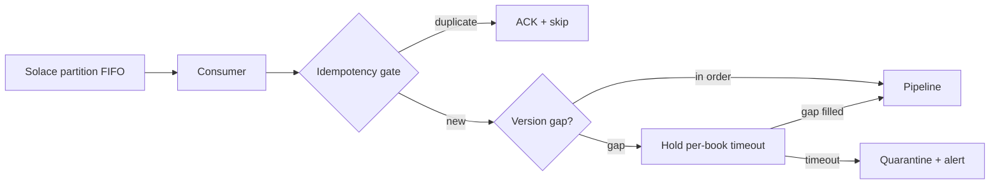
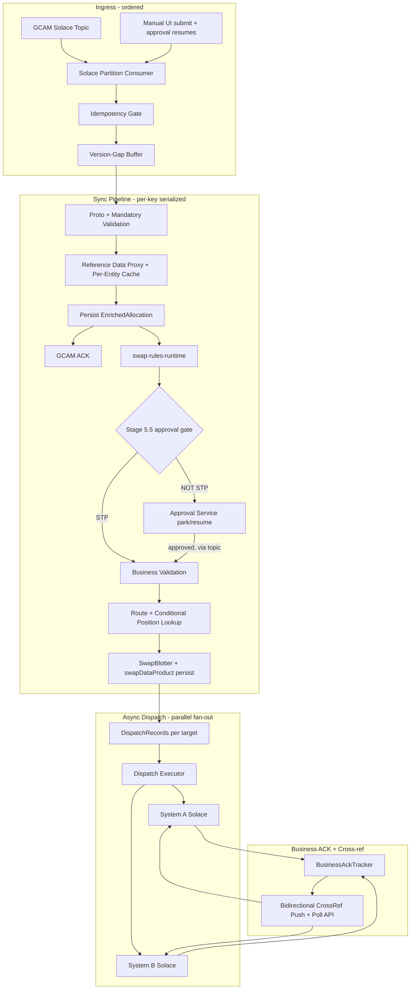
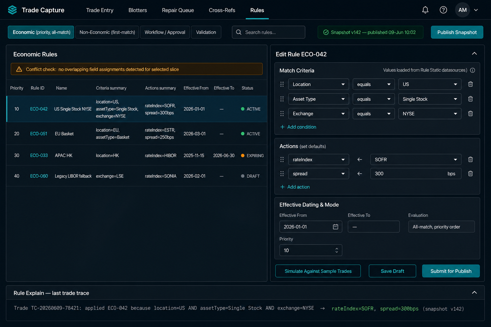
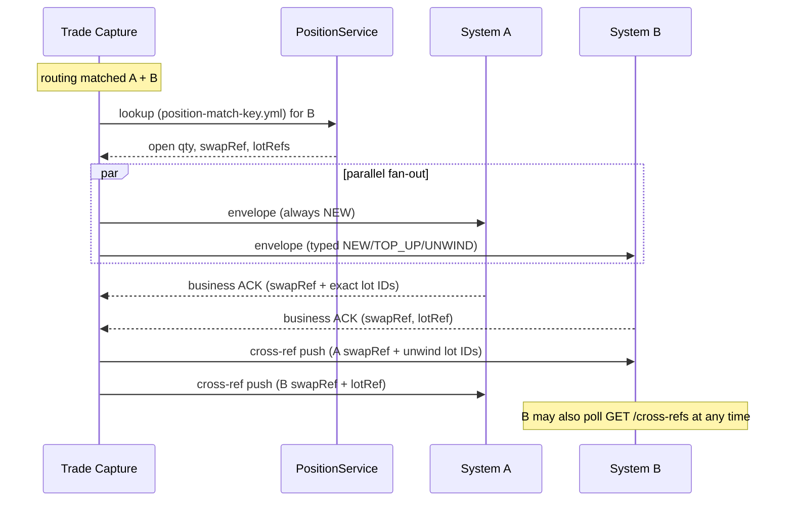
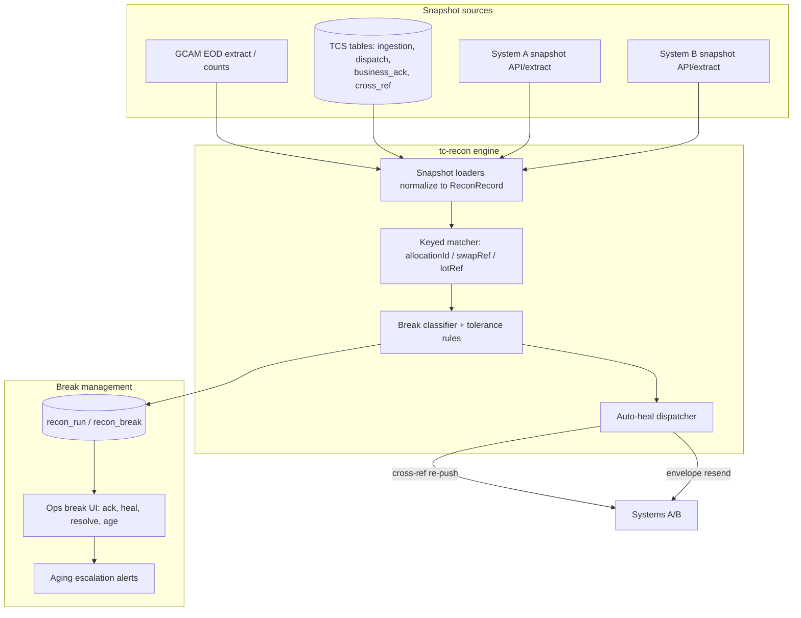
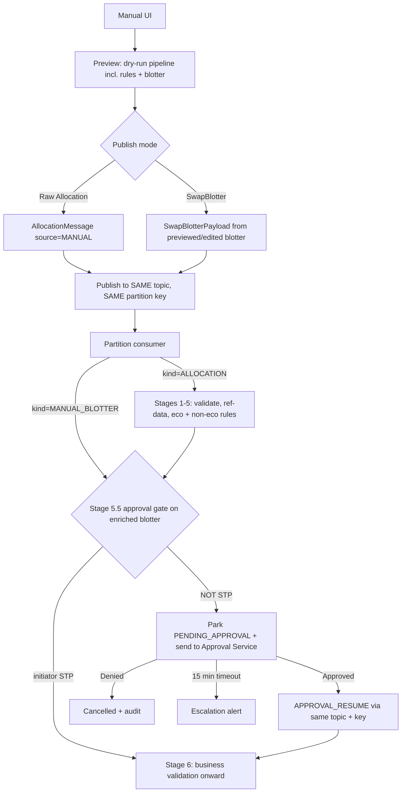
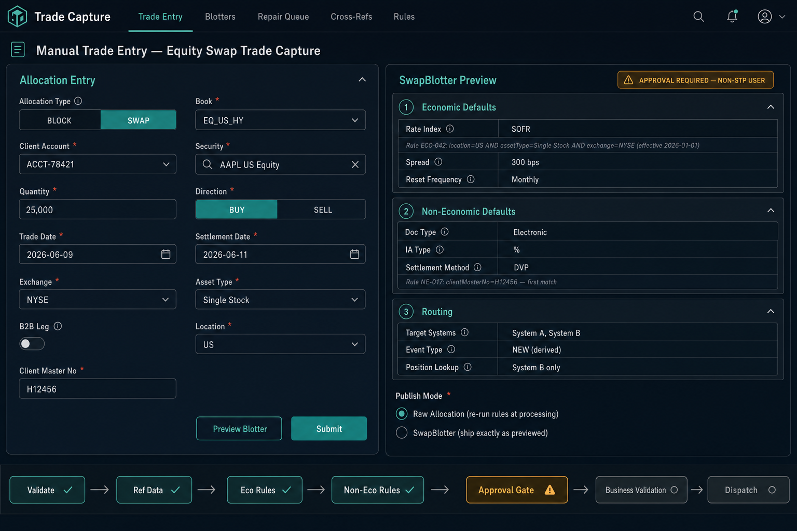

# Trade Capture Service — Target Architecture (v3, final)

Upstream trade capture system for the Equity Swap Lifecycle Management platform.
Ingests allocation messages from GCAM (via Solace), validates, enriches, applies
defaulting rules, routes, and publishes fully-formed `SwapBlotter` messages to
downstream booking/position systems with cross-reference tracking.

**Status**: Approved design. F0/F1 detailed in
[f0-f1-component-spec.md](f0-f1-component-spec.md).

---

## 1. Decision register (locked)

| # | Topic | Decision |
|----|-------|----------|
| D1 | Processing model | Modular monolith, stage-isolated modules, scale via partition consumers |
| D2 | Ordering | Solace partitioned queue FIFO per key + **version-gap buffer only** (no general reorder buffer) |
| D3 | Sequence key | `(Book, AccountId, SecurityId)`; AccountId = ClientAccount (Swap) / WashBook (Block) |
| D4 | Idempotency key | `(BlockId, AllocationId, Version)` + GCAM messageId |
| D5 | GCAM ACK point | After `enriched_allocation` persisted (single SQL txn). Never blocked by downstream |
| D6 | Ref-data failure | NACK → **3 retries** → ACK + repair quarantine + ops UI |
| D7 | Rules | `swap-rules-runtime` compiled snapshots; economic = all-match in priority order, non-economic = first-match (configurable); effective-date ranges compiled into one snapshot, filtered by trade date |
| D8 | Block allocations | Same schema, same routing rules as Swap; WashBook substitutes ClientAccount in sequence key; act as temporary swap allocations downstream |
| D9 | Amend/cancel | New version = new pipeline run; no downstream recall/compensation; `supersedes_version` audit only |
| D10 | Routing | Book + assetType, config-driven; position match key in `position-match-key.yml` per environment |
| D11 | System A | Send everything as NEW; no position lookup; A derives event type internally |
| D12 | System B | Position lookup → derive NEW/TOP_UP/UNWIND → envelope → **send immediately**; unwind lot detail delivered asynchronously (D15) |
| D13 | Fan-out | Truly parallel; no inter-target send dependency |
| D14 | Business ACK | Separate `business_ack` table (FK to `dispatch_record`), not a dispatch status |
| D15 | Cross-ref | **Bidirectional** push (A refs → B incl. unwind lot IDs; B refs → A) on each business ACK + poll API for recovery; required only for multi-target trades |
| D16 | Cache | **Per-entity policy** (`cache-policy.yml`): static attributes cached, status/eligibility fields read-through or short-TTL |
| D17 | Manual trades & approval | Same Solace topic, **dual publish mode** (Raw Allocation or SwapBlotter); approval is a **post-enrichment pipeline gate (stage 5.5)** routed on the enriched SwapBlotter + initiator STP status — NOT a pre-queue gate; non-STP initiators park until Approved; resume re-enters via same topic/key; 15-min timeout → escalation (see §8) |
| D18 | Version-gap timeout | Book-specific config (`version-gap.yml`) |
| D19 | State store | SQL Server everywhere; monthly partitions on trade_date; `swap-archiver`-pattern archive at 90 days post-lifecycle-complete; lookup fallback to System A |
| D20 | Cutover | Shadow mode default; dual publish per book/target feature flag |
| D21 | Manual blotter governance | **Accept** (option 1): licensed-trader approval covers non-economic overrides; edited-fields diff audited; dual approval can be bolted on later if metrics show abuse |
| D22 | Ref-data retry count | 3 attempts, backoff 1s / 5s / 15s |
| D23 | Bulk trade upload | CSV/XLSX upload in manual UI; per-row validation report; each valid row published as an individual Raw-Allocation `TcsIngressMessage` with its own partition key; batch-level approval grouping at the stage-5.5 gate (see §8.5) |
| D24 | Bulk rules operations | Multi-select bulk edit (effective dates, enable/disable, priority, clone), CSV/YAML import/export; all bulk changes flow through draft → conflict detection → batch simulation → single snapshot publish (see §6.1) |
| D25 | Reconciliation | Three recon types (ingestion completeness, instruction-vs-booking, A↔B sync) in one `tc-recon` engine; snapshot-based (read-only against downstream), watermarked to exclude in-flight trades; auto-heal limited to idempotent TCS-side actions (cross-ref re-push, resend); QTY/STATUS breaks always human-resolved (see §7.1) |

### External contract prerequisites (raise with owning teams before F1 code freeze)

1. **GCAM ordering contract** — written guarantee that publish order onto the
   topic = business order per sequence key, *or* a per-key `key_sequence`
   counter added to the proto. Without one of these, no consumer-side
   mechanism can recover cross-allocation order.
2. **System A business-ACK latency distribution** (P50/P99) — drives the
   cross-ref/lot-delivery SLA to System B and the 15-minute milestone budget.
3. **GCAM proto envelope** — agree whether GCAM publishes the
   `TcsIngressMessage` envelope directly or TCS wraps at the consumer edge
   (same meeting as item 1).

---

## 2. Domain model

| Concept | Decision |
|---------|----------|
| Block → Swap | 1:M; block can exist before client allocation |
| Mutability | Versioned replacements, never in-place edits |
| SwapBlotter | 1:1 with allocation at capture; unwind may close one blotter/lot and create new ones downstream |
| Contract-like | After economic + non-economic defaulting; business validation = integrity gate before publish |
| Block role | Staging **and** temporary swap allocation for downstream until client allocation exists |

### Two keys — never conflate

| Key | Formula | Purpose |
|-----|---------|---------|
| **Sequence / partition** | `hash(Book, AccountId, SecurityId)`; AccountId = ClientAccount (Swap) or WashBook (Block) | Solace partition, consumer affinity, per-key serialization |
| **Idempotency / correlation** | `(BlockId, AllocationId, Version)` + GCAM messageId | Dedup, amend detection, audit trail, tracing |

AllocationId is deliberately **not** in the sequence key: two allocations for
the same `(Book, Client, Security)` must process in arrival order for position
correctness.

---

## 3. Ordering model

Two mechanisms, strictly scoped:

| Concern | Mechanism |
|---------|-----------|
| Different allocations on the same key, in order | **Solace partitioned queue FIFO**: partition key = hash(sequence key); one active consumer per partition; single-threaded pipeline per key. No buffering, no gap detection — without a per-key contiguous counter there is nothing to detect. |
| Versions of the *same* allocation, in order | **Version-gap buffer**: if version N+2 arrives while N+1 is unseen, hold N+2 (DB-backed) for a book-specific timeout, then quarantine. Bounded, rarely triggered, no spike memory risk. |



- Start with **128 partitions**; consumers ≤ partition count.
- HPA gates: partition lag, pipeline latency P99, DB connection wait.
- Spike profile (7K–15K / 10 min at market close) spreads across keys and
  partitions; per-key processing stays serial.
- If GCAM later supplies `key_sequence`, full gap detection is enabled by
  config flag (`gapDetection.useKeySequence`) — no code or proto change.

---

## 4. System overview



Manual-blotter entries (§8) join the same queue but enter the pipeline at the
stage-5.5 approval gate (already enriched). Approval resumes re-enter the same
queue as `APPROVAL_RESUME` control messages to preserve per-key ordering.

---

## 5. Pipeline stages

| Stage | Action | GCAM Solace | SQL commit |
|-------|--------|-------------|------------|
| 0 | Partition consume, idempotency, version-gap check | dup → ACK | hold row if gap |
| 1 | Proto + mandatory field validation | fail → NACK | audit reject row |
| 2 | Ref-data enrich (Security, ClientAccount, Book, WashBook) | fail → NACK ×3 → ACK+quarantine | quarantine row on 3rd |
| 3 | Persist enriched allocation | **ACK** | `ingestion_record` + `enriched_allocation`, one txn |
| 4 | Economic rules (all-match, priority order) | — | — |
| 5 | Non-economic rules (first-match) | — | — |
| **5.5** | **Approval gate**: workflow rules evaluate enriched SwapBlotter + initiating user. STP → continue; NOT STP → persist blotter draft `PENDING_APPROVAL`, **park** (release the key), send to Approval Service. On Approved → resume at stage 6 in key order; Denied → cancelled + audit; 15-min timeout → escalation | — | blotter draft + `PENDING_APPROVAL` |
| 6 | Business validation *(resume point after approval; entry point for manual-blotter mode is the 5.5 gate)* | — | fail → repair quarantine (post-ACK, internal) |
| 7 | Routing + conditional position lookup (explicit-event-type targets only) | — | `routing_decision` |
| 8 | SwapBlotter + swapDataProduct persist + rule explain | — | blotter txn |
| 9 | Create `dispatch_record` per enabled target | — | same txn as 8 |
| 10 | Dispatch executor (async, parallel per target) | — | dispatch status updates |
| 11 | Business ACK consumer | — | `business_ack` rows |
| 12 | **Bidirectional** cross-ref push (multi-target): A refs + unwind lot IDs → B; B refs → A | — | `cross_ref` per direction |

GCAM is never blocked past stage 3. Stages 0–9 run single-threaded per
sequence key; 10–12 are key-independent. A trade parked at the 5.5 gate
**releases the partition** — other trades on the same key continue; on
approval, an `APPROVAL_RESUME` control message re-enters via the same
partitioned topic so the resumed trade is re-serialized in key order before
business validation, routing, and position lookup (which therefore see
*current* state, not state at park time).

### Failure policy summary

| Failure | GCAM Solace | Internal |
|---------|-------------|----------|
| Structural / proto invalid | NACK (→ DLQ after redelivery 3) | `audit_reject` |
| Ref-data miss, attempts 1–2 | NACK (redeliver, backoff) | `audit_reject` per attempt |
| Ref-data miss, attempt 3 | **ACK** | `repair_quarantine` — trade becomes TCS-owned, GCAM stops retrying |
| Business validation | already ACK'd | repair quarantine + ops override UI; re-run validation only after edit |
| Business ACK timeout | already ACK'd | retry inquiry → escalate; partial success → ops UI |

---

## 6. Rules layer (`swap-rules-engine` integration)

| Requirement | Component |
|-------------|-----------|
| Economic: all matches, priority order | `LayeredEnrichmentStrategy` + compiled attribute buckets |
| Non-economic: first match (configurable) | `FirstMatchExclusiveStrategy` per target domain |
| Effective dating by trade date | `RuleSnapshot` compiled with `[effectiveFrom, effectiveTo)` ranges on every rule; `bucketFor(...)` filters by the trade's as-of date. One snapshot, no per-date cache. **Requires `RuleCompiler` change — scheduled in F3.** |
| Layman explainability | `BoundedTrace` → `rule_explain` table + `TraceNarrator` |
| Conflict prevention at authoring | admin conflict detector on publish (no same-field overlap for same criteria slice) |
| RuleStatic dropdowns | `swap-rules-admin` extension: datasource-backed enumerations per field |
| Preview / dry-run | `EnrichmentEngine.enrich()` invoked synchronously, no persist, no publish |
| Approval routing (stage 5.5 gate) | `WORKFLOW` category rules, `FirstMatchExclusiveStrategy`: criteria on enriched blotter attributes + initiator → STP / approver group; configurable without deploys, traced via `rule_explain` |
| Egress shape | Rules populate `swapDataProduct.*` on the SwapBlotter |

Snapshot distribution: admin publishes → broadcast → TCS
`AtomicReference<RuleSnapshot>` swap (already in `EnrichmentEngineImpl`).

Mapping: `EnrichedAllocationMessage` → `RawHedgeTrade` (adapter) →
`EnrichedEquitySwap` → merged into `SwapBlotter` aggregate.

### 6.1 Rules management UI & bulk operations (D24)



Capabilities (target state for evolving `swap-rules-admin`):

| Capability | Behavior |
|------------|----------|
| Category workspaces | Economic (priority, all-match) / Non-Economic (first-match) / Workflow-Approval / Validation — evaluation mode visible in the workspace header, configurable per rule metadata |
| Structured authoring | Criteria builder: dimension dropdowns fed by **Rule Static datasources** (no free text); actions as field ← value assignments; SpEL escape hatch flagged and listed separately |
| Effective dating | `effectiveFrom` / `effectiveTo` per rule version; expiring rules surfaced with status chips |
| Conflict detection | On save and on publish: no overlapping field assignment for the same criteria slice; blocking error with the conflicting rule IDs |
| **Bulk edit** | Multi-select rows → bulk actions: shift effective dates, enable/disable, re-prioritize (with collision re-sequencing), clone-to (new book/region/asset type with criteria substitution) |
| **Bulk import/export** | CSV/YAML round-trip; import lands as **drafts** in a changeset, never directly active; export respects current filter |
| Changeset model | Every bulk operation produces a named changeset; the changeset is simulated and published atomically — one snapshot version, all-or-nothing |
| Batch simulation | "Simulate Against Sample Trades" runs the **entire changeset** against a configurable sample set (golden fixtures + recent production replays); diff report: fields changed per trade, rules hit before/after |
| Publish | Changeset → conflict check → simulation sign-off → snapshot compile → broadcast; snapshot version recorded on every `rule_explain` trace |
| Audit | Per-rule, per-field change history with author, timestamp, changeset id; rule lifecycle: DRAFT → ACTIVE → EXPIRING → RETIRED |
| Entitlements | Economic rules: traders; Non-economic: Ops/MO; Workflow/Approval: supervisors — enforced per category workspace |

---

## 7. Routing, event typing, dispatch, cross-references

### Routing

Dimensions: Book + assetType, extensible via config (no hardcoding).

```yaml
# routing-rules.yml (shape)
targets:
  system-a:
    explicitEventType: false
    positionLookup: NEVER          # optimistic: everything sent as NEW
  system-b:
    explicitEventType: true
    positionLookup: BEFORE_ROUTE   # NEW / TOP_UP / UNWIND derived
```

```yaml
# position-match-key.yml
default:
  fields: [book, clientAccount, security, direction]
systems:
  SYSTEM_B:
    matchKey:
      fields: [book, clientAccount, security, direction, swapStructure]
```

### System B flow (clarified)



- B's envelope is sent **immediately** after position lookup — no dependency
  on A's ACK.
- For **UNWIND**, B pends internally on lot detail; TCS pushes it the moment
  A's business ACK arrives (B lacks HICO/LIFO — operates custom-lot unwind
  only). B can also pull via the poll API.
- `dispatch_record` has no dependency gating; the dependency lives in
  `cross_ref` delivery state.

### Cross-ref tracking (bidirectional)

Each direction is an independent row with its own state:

| Trigger | Push | Content |
|---------|------|---------|
| A's business ACK (B was a target) | TCS → **B** | A's swapRef + exact unwind lot IDs |
| B's business ACK (A was a target) | TCS → **A** | B's swapRef + lotRef |

Cross-ref milestone = both directions DELIVERED. Poll API serves both
directions for recovery/backfill. The symmetric dataset (A's view vs B's view
vs TCS cross-ref table) is the input to R3 reconciliation (§7.1).

Single-target trades: business ACK still tracked; no cross-ref rows.

### Dispatch executor (rewrite — do not reuse sibling repo worker as-is)

The reference `FanOutDispatchWorker` performs network I/O inside one
`@Transactional` poll loop — a stall pattern under spike. Keep the
`DispatchRecord` state machine, replace the executor:

1. Short txn: claim batch (`PENDING AND next_attempt_at <= now` → `CLAIMED`,
   row-locked).
2. Release txn; dispatch concurrently with **per-destination thread pools**
   (B down never throttles A).
3. Small txns to write results: `SENT` / backoff retry / `FAILED` + DLQ after
   max attempts.
4. Recompute ingestion status → `SENT | PARTIALLY_SENT | FAILED`;
   `PARTIALLY_SENT` surfaces on the ops UI with per-record actions (retry,
   skip, manual reconcile).

Business ACKs land in `business_ack` (separate table, FK to dispatch record —
D14). Timeout scheduler: no ACK within per-target SLA → retry inquiry →
escalation alert. No GCAM impact (already ACK'd).

### 7.1 Reconciliation architecture (D25)

TCS is the **system of record for what was instructed**; Systems A/B are the
systems of record for what was booked. Reconciliation closes the loop across
three boundaries with one engine and one break-management workflow.



**Reconciliation types**

| Type | Compares | Detects | Cadence |
|------|----------|---------|---------|
| R1 — Ingestion completeness | GCAM EOD counts/extract vs `ingestion_record` | Missed/unprocessed allocations, version gaps that timed out silently | EOD + on-demand |
| R2 — Instruction vs booking | TCS dispatched + business-ACKed view vs System A/B snapshots | Orphans (booked downstream but unknown to TCS, or instructed but absent downstream), key-economics drift (qty, direction, security) | EOD full + intraday incremental (T-day trades, hourly) |
| R3 — Cross-system sync (A ↔ B) | A's swap/lot refs vs B's, via TCS `cross_ref` | Missing peer refs, lot mismatches after custom-lot unwinds, status divergence | Intraday incremental + EOD |

**Matching & classification**

- Match keys in precedence order: `allocationId` → `swapRef` → `lotRef`;
  composite fallback `(book, account, security, tradeDate, qty)` for orphan
  candidates.
- Field comparison driven by a **configurable manifest** (reuses the F9
  parity-manifest mechanism: must-match / tolerance / ignore per field).
- Break taxonomy: `MISSING_IN_A` · `MISSING_IN_B` · `MISSING_IN_TCS` ·
  `REF_MISMATCH` · `QTY_MISMATCH` · `STATUS_MISMATCH` · `LOT_MISMATCH` ·
  `DUPLICATE`.

**Break lifecycle & auto-heal**

```
DETECTED → (auto-heal eligible?) → HEALING → RESOLVED_AUTO
        → ACKNOWLEDGED → RESOLVED_MANUAL | WRITTEN_OFF (with reason + approver)
        → aging thresholds (24h / 48h) → escalation alerts
```

Auto-heal is limited to **safe, idempotent TCS-side actions**: cross-ref
re-push (FR-403), poll-API backfill, envelope resend (FR-601). The engine
never mutates downstream economics; QTY/STATUS breaks always require human
resolution. Re-run after heal confirms closure (a break is only
`RESOLVED_AUTO` when the next incremental run no longer detects it).

**Persistence**: `recon_run` (run id, type, scope, snapshot watermarks,
totals) and `recon_break` (run id, type, keys, both-side values, status,
resolution, aging) — monthly partitioned like other hot tables, archived on
the same policy.

**Design constraints**

- Read-only against downstream: snapshots via API/extract, never direct DB.
- Snapshot watermarking: each side's extract carries an as-of timestamp;
  matcher only compares records both sides could know about (avoids false
  breaks from in-flight trades — anything younger than the in-flight horizon,
  default 30 min, is excluded).
- Runs are restartable and idempotent per `(type, scope, as-of)`.

---

## 8. Manual trade path & approval gate

Manual trades are booked by trading assistants. Approval is **not** a
pre-queue gate on raw input — it is a **pipeline gate after economic and
non-economic enrichment (stage 5.5)**, routed on the **enriched SwapBlotter**
plus the initiating user's STP status. The approver therefore signs off on
the actual enriched blotter that will be booked, not a preview or raw input.

### Approval gate (stage 5.5) — applies to every trade

| Input | Outcome |
|-------|---------|
| Initiating user/source is **STP** (GCAM and other system sources are STP by definition) | Continue straight to business validation — no pause |
| Initiating user is **NOT STP** (e.g. trading assistant) | Persist enriched blotter draft `PENDING_APPROVAL`, **park** the trade (partition released), send blotter to Approval Service |
| Approved | `APPROVAL_RESUME` control message → same topic, same partition key → resume at stage 6 in key order |
| Denied | `APPROVAL_DENIED` → cancelled, audited, surfaced on UI |
| No response in 15 min | Escalation alert; remains pending |

Approval routing is itself a **workflow rule pack** (first-match) evaluated
on enriched blotter attributes + initiator — same `swap-rules-runtime`
machinery (`WORKFLOW` category, `FirstMatchExclusiveStrategy`), so approval
criteria are configurable without deploys and produce a `rule_explain` trace
like any other rule.

Because business validation, routing, and position lookup all run **after**
approval (at resume), they see *current* position and reference state — there
is no stale-approval window to guard against. The previously proposed
preview-hash guard is obsolete and removed.

### Flow



### Why everything goes through the same queue

A blotter or resume injected out-of-band (direct API into stage 6) would
bypass per-key serialization: an in-flight GCAM allocation on the same
sequence key could race it into routing/position-lookup, corrupting
position-derived event typing. Therefore **both publish modes and approval
resumes use the same partitioned topic with the same partition key**; the
payload kind decides the *entry stage*, not the *entry point*. One queue, one
consumer, one ordering guarantee. Business validation always runs — the skip
is stages, not safeguards.

### Mode semantics

| Aspect | Raw Allocation mode | SwapBlotter mode |
|--------|---------------------|------------------|
| Entry stage | 1 (full: validate → ref-data → rules → 5.5 gate) | 5.5 gate directly (payload is already an enriched blotter) |
| Rules applied | At processing time (current snapshot) | **Frozen at preview time** — edited blotter ships as-is |
| Approval artifact | The pipeline-enriched blotter produced at stage 5 | The submitted (previewed/edited) blotter |
| Ref-data | Resolved at processing time | Snapshot from preview; business validation re-checks correctness-critical fields (e.g. security active — read-through per `cache-policy.yml`) |
| Use case | "Book this like GCAM would" | "I previewed, edited defaults, ship exactly this" |
| Idempotency key | TCS-minted `(blockId=MAN-{uuid}, allocationId, version=1)` | Same scheme, `entry_mode=MANUAL_BLOTTER` |
| Approval | Per stage-5.5 gate: required iff initiator NOT STP | Same gate; blotter mode is the higher-risk path — approver signs exact field values, aided by the edited-fields diff |

### Governance (D21 — Accepted)

Blotter mode bypasses the rules engine, including Ops/MO-owned non-economic
rules. Accepted on the basis that the stage-5.5 approval gate covers the
overrides, with mitigations:

- Approval request carries the mode and, for blotter mode, an
  **edited-fields diff** vs the rule-derived preview.
- `rule_explain` for blotter-mode entries records: "MANUAL_BLOTTER — rules
  frozen at preview {timestamp}, snapshot {version}, edited fields: [...]".
- Metric `tc.business.validation.fail{entry_mode}` monitored; if blotter-mode
  failure/abuse rates rise, dual approval (Ops/MO co-sign on non-economic
  edits) is the prepared escalation.
- STP status itself is configuration (workflow rules), so tightening who
  flows straight through requires no deploy.

### 8.4 Manual trade entry UI



- Left: allocation entry form mirroring the GCAM `AllocationMessage`
  (BLOCK/SWAP toggle, sequence-key components, economics, B2B leg).
- Right: dry-run **SwapBlotter preview** with per-field rule provenance in
  layman terms (`TraceNarrator` output) and the routing outcome.
- Approval-gate status chip computed at preview time (STP vs approval
  required).
- Publish Mode selector = D17 dual mode.
- Footer pipeline chips show where the trade will pause (gate amber).

### 8.5 Bulk trade upload (D23)

| Aspect | Behavior |
|--------|----------|
| Input | CSV/XLSX against a downloadable template matching the `AllocationMessage` field set; max **10,000 rows** per file (configurable) |
| Validation | Synchronous per-row structural + mandatory-field validation on upload; row-level error report (row #, field, reason) downloadable; valid and invalid rows separable — user may submit valid subset |
| Publication | Each valid row → individual Raw-Allocation `TcsIngressMessage`, `source=MANUAL`, `initiated_by=uploader`, idempotency key `blockId=MAN-{batchId}-{rowNo}`; published with the row's **own partition key** so per-key ordering holds across the batch and against GCAM traffic |
| Preview | Optional sampled preview (first N rows + any row on demand) — full-file dry-run is not run synchronously at 10K rows |
| Approval gate | Applies per trade as usual; rows from a non-STP uploader are parked **grouped by `batch_id`** — the Approval Service request carries the batch summary (count, notional totals, books touched) and supports **batch approve / batch deny / per-row carve-out**, preventing 10K individual approval items |
| Tracking | Batch dashboard: per-row status rollup (validated / parked / approved / booked / failed / quarantined), linked to ingestion records |
| Failure isolation | A failing row never blocks other rows; failures land in the standard repair queue tagged with `batch_id` |

---

## 9. Reference data — per-entity cache policy

`ReferenceDataProxy` interface hides Caffeine (now) / Redis (later).
Invalidation events on a Solace topic fan to all instances; fallback TTL
bounds the propagation window. Correctness-critical fields are never served
stale.

```yaml
# cache-policy.yml
entities:
  security:
    staticFields:   { mode: CACHE, ttl: 4h,  invalidation: event }
    statusFields:   { mode: READ_THROUGH }      # inactive security = hard correctness
  clientAccount:
    staticFields:   { mode: CACHE, ttl: 1h,  invalidation: event }
    eligibility:    { mode: CACHE, ttl: 30s }   # short-TTL compromise
  book:             { mode: CACHE, ttl: 4h,  invalidation: event }
  washBook:         { mode: CACHE, ttl: 1h,  invalidation: event }
```

WashBook resolution: derived from ClientAccount + B2BLeg + Exchange (+
allocation attributes), never sent by GCAM.

---

## 10. Persistence, archive, APIs

### Hot tables (SQL Server, monthly partition on `trade_date`)

`ingestion_record` · `enriched_allocation` · `swap_blotter` · `rule_explain` ·
`routing_decision` · `dispatch_record` · `business_ack` · `cross_ref` ·
`manual_trade` · `repair_quarantine` · `audit_reject` · `version_gap_hold` ·
`recon_run` · `recon_break`

`manual_trade` holds **UI drafts only** (pre-submit). Once published to the
queue, the trade lives in `ingestion_record` like any other; the draft row
links to it via `ingestion_id` for the UI.

### Archive

- Sliding window: current + 2 months hot.
- Eligibility: lifecycle complete + cross-refs established + 90 days past.
- Mechanism: partition switch to archive filegroup / archive tables, reusing
  the `swap-archiver` engine patterns (preflight, chunked, checkpointed,
  adaptive).

### REST API inventory

All endpoints under `/api/v1`; OpenAPI YAML to be checked in per phase as
endpoints land. Lookup fall-through: hot → archive → System A API.

| Area | Endpoint | Purpose | Phase |
|------|----------|---------|-------|
| Lookup | `GET /trades/{ingestionId}` | Full trade journey: ingress, enrichment, blotter, rule explains, routing, envelopes, ACKs, cross-refs, approvals (FR-603) | F10 |
| Lookup | `GET /trades?allocationId=&blockId=&swapRef=&lotRef=&clientAccount=&book=&tradeDate=` | Dimensional search with hot → archive → System A fall-through (FR-600) | F10 |
| Resend | `POST /trades/{ingestionId}/resend?target={systemId}` | Idempotent re-dispatch (FR-601) | F10 |
| Cross-ref | `GET /cross-refs?allocationId=&swapRef=&direction=` | Poll API for Systems A/B, both directions (FR-404) | F7 |
| Cross-ref | `POST /cross-refs/{ingestionId}/sync` | Re-push both directions (FR-601) | F7 |
| Manual | `POST /manual-trades/preview` | Dry-run pipeline: blotter + rule explains + gate outcome, no persist/publish | F8 |
| Manual | `POST /manual-trades` | Submit; body carries publish mode (RAW_ALLOCATION / SWAP_BLOTTER) | F8 |
| Manual | `POST /manual-trades/bulk` (multipart) | Bulk upload; returns per-row validation report + batchId (FR-504) | F8 |
| Manual | `GET /manual-trades/bulk/{batchId}` | Batch status rollup (FR-506) | F8 |
| Approval | `POST /approvals/callback` | Approval Service webhook: Approved/Denied per approvalId or batchId | F8 |
| Repair | `GET /repair?category=&status=` · `PUT /repair/{id}` (edit fields) · `POST /repair/{id}/reprocess` · `POST /repair/{id}/discard` | Quarantine workflow (FR-209/300) | F4 |
| Recon | `POST /recon/runs` (type, scope, asOf) · `GET /recon/runs/{runId}` · `GET /recon/runs/{runId}/breaks` | Trigger + inspect runs (FR-707) | F12 |
| Recon | `POST /recon/breaks/{breakId}/{ack\|heal\|resolve\|write-off}` | Break workflow (FR-704/705) | F12 |
| Rules (existing `swap-rules-admin`, extended) | `POST /rules` · `POST /snapshots/publish` · `POST /rules/simulate` + bulk changeset endpoints | Authoring + D24 bulk ops | F11 |

Authentication/entitlements: firm-standard SSO; entitlement checks per
persona (§6.1 rules entitlements; repair/recon = Ops; resend = Ops/SRE).

---

## 11. Non-functional requirements

### Load profile

- 1.5–2M trades/day ≈ 23 msg/s average.
- Spike: 7–15K trades / 10 min at market close, concentrated per Book+Client.
- Headroom target: 500–1,000 msg/s peak per partition group.

### 15-minute regulatory SLA milestones

| Milestone | Target | Owner |
|-----------|--------|-------|
| T+0 | GCAM ACK (enriched persist) | TCS |
| T+1 min | SwapBlotter complete | TCS + rules engine |
| T+3 min | Dispatched to all routed targets | TCS |
| T+8 min | Business ACKs received | Systems A/B |
| T+10 min | Cross-refs / unwind lot detail delivered | TCS |
| T+15 min | Position Service → Data Hub → FpML → regulator | downstream chain |

T+8/T+10 budgets are provisional pending System A's ACK latency distribution
(external prerequisite 2).

### Resilience / self-healing

- Backpressure: pause partition consumption when repair queue depth or DB
  latency exceeds gates.
- Circuit breaker on reference APIs → fast-fail to quarantine, never block
  the partition.
- Dispatch retry with exponential backoff → DLQ → ops UI.
- Version-gap holds are DB-backed — survive restarts; in-memory index rebuilt
  on partition assignment.
- HPA on partition lag / pipeline P99 / DB connection wait; max replicas ≤
  partition count.

### Observability (ESaaS / Observe)

Correlation id `(blockId, allocationId, version)` on every span, propagated to
Position Service, Approval Service, Systems A/B.

| Group | Metrics |
|-------|---------|
| SLA | `tc.sla.elapsed_ms{stage}` · `tc.sla.breach` |
| Ingress | `tc.ingress.rate{type,source,book}` · `tc.partition.lag{partition}` · `tc.gcam.ack.latency` |
| Ordering | `tc.version_gap.held{book}` · `tc.version_gap.quarantined{book}` |
| Quality | `tc.validation.fail{stage,reason}` · `tc.refdata.miss{entity,attempt}` · `tc.business.validation.fail{rule,entry_mode}` · `tc.rule.applied{ruleId,category}` |
| Cache | `tc.cache.read_through.latency{entity}` · hit ratios per entity |
| Dispatch | `trade.dispatch.success/failure/dlq{destination}` · `tc.business_ack.pending{destination}` · `tc.business_ack.latency{destination}` |
| Cross-ref | `tc.crossref.pending{direction}` · `tc.crossref.lot_delivery.latency` · `tc.partial.success` |
| Manual / approval | `tc.manual.publish{mode}` · `tc.approval.gate{outcome}` (STP_PASS / PARKED / DENIED) · `tc.approval.pending` · `tc.approval.timeout` · `tc.approval.park_to_resume.latency` · `tc.manual.blotter.edited_fields` |
| Bulk | `tc.bulk.upload.rows{result}` (valid / invalid / submitted) · `tc.bulk.batch.status{status}` · `tc.rules.changeset.published` · `tc.rules.bulk_edit.rules_touched` |
| Recon | `tc.recon.run.duration{type}` · `tc.recon.breaks.detected{type,break_class}` · `tc.recon.breaks.open{break_class}` · `tc.recon.auto_heal{result}` · `tc.recon.break.age_hours` (histogram) |
| Ingestion | `tc.ingestion.status{status}` (incl. `PARTIALLY_SENT`) · `tc.quarantine.open{category}` |

---

## 12. Testing & cutover strategy

| Mode | Behavior |
|------|----------|
| Configurable field diff | SwapBlotter compare profile (YAML/DB): must-match vs tolerance vs ignore — user-definable per field |
| Synthetic fixtures | Generated from legacy DB extracts during migration; test harness publishes proto onto the real ingress topic |
| Record/replay | Production-like messages for regression once live |
| Shadow | Full pipeline through blotter persist, no downstream publish; diff against legacy blotter (different database) |
| Dual publish | Feature flag per book/target where downstream supports it |
| Acceptance | Full match or explainable mismatch; 2M/day soak + 15K/10-min spike certification |

Legacy parity scope: **full blotter** (economic + non-economic fields).

---

## 13. Module structure

```
trade-capture-service/
├── tc-ingress/          Solace partition consumers, idempotency, version-gap buffer, ACK/NACK
├── tc-validation/       Proto + mandatory field checks
├── tc-reference/        ReferenceDataProxy, per-entity cache, invalidation listeners
├── tc-enrichment/       EnrichedAllocation persist, adapter to swap-rules-runtime
├── tc-blotter/          SwapBlotter aggregate + swapDataProduct, lifecycle status
├── tc-routing/          Routing rules, position-match-key.yml, PositionService client
├── tc-outbound/         Envelope builder, dispatch executor, business ACK tracker
├── tc-crossref/         Bidirectional push, poll API
├── tc-recon/            Snapshot loaders, keyed matcher, break classifier,
│                        auto-heal dispatcher, break workflow backend (§7.1)
├── tc-approval/         Stage-5.5 gate, park/resume, Approval Service client, 15-min timeout scheduler
├── tc-manual/           Manual UI backend: preview, dual-mode publish
├── tc-api/              Lookup, resend, sync, archive fallback to System A
├── tc-repair/           Quarantine + override UI backend
├── tc-observability/    Micrometer metrics → ESaaS/Observe
└── tc-config/           version-gap.yml, cache-policy.yml, routing-rules.yml,
                         position-match-key.yml, ingress.yml

Libraries (this repo):
├── swap-rules-core / swap-rules-runtime    ← hot-path enrichment engine
├── swap-rules-admin                        ← separate deploy: authoring + snapshot publish
├── swap-rules-shadow                       ← shadow diff harness basis
└── swap-archiver                           ← archive engine patterns
```

---

## 14. Delivery phases

| Phase | Deliverable |
|-------|-------------|
| **F0** | Proto contract, keys, DDL, Solace topology, config files — see [f0-f1-component-spec.md](f0-f1-component-spec.md) |
| **F1** | Ingress: partition consumer, idempotency, version-gap buffer, validation, ref-data (direct lookup), enriched persist + ACK/NACK, quarantine |
| F2 | Per-entity cache policy + invalidation bus |
| F3 | swap-rules-runtime wiring, SwapBlotter/swapDataProduct, rule explain; `RuleCompiler` effective-date range change |
| F4 | Business validation + repair UI backend |
| F5 | Routing + PositionService client + position-match-key.yml |
| F6 | Dispatch executor (rewritten) + System A + business ACK |
| F7 | System B + bidirectional cross-ref push/poll + unwind lot delivery + partial-success UI |
| F8 | Approval gate (stage 5.5): workflow rule pack, park/resume via `APPROVAL_RESUME`, Approval Service integration, 15-min escalation; manual UI: preview + dual publish mode; **bulk trade upload** (D23) |
| F9 | Shadow harness + legacy blotter diff (configurable field manifest) |
| F10 | Dual publish flags + archive + System A fallback API |
| F11 | Rules admin evolution: bulk edit, changeset import/export, batch simulation (D24) |
| F12 | Reconciliation: R3 cross-system sync first (highest risk — custom-lot unwinds), then R2 instruction-vs-booking, then R1 ingestion completeness; break UI + auto-heal (D25) |

---

## 15. Integration contracts (provisional)

Working-assumption payload shapes until the owning teams confirm (PRD
§11: E4, E5, E10). Implement behind interfaces; treat field names as
negotiable, **semantics as fixed**. All payloads carry the correlation id
`(blockId, allocationId, version)`.

### 15.1 Approval Service (E4) — F8

```jsonc
// TCS → Approval Service: request (single trade or batch)
{
  "approvalId": "APR-...",            // TCS-minted
  "kind": "TRADE | BATCH",
  "ingestionId": "…",                  // TRADE kind
  "batchId": "…",                      // BATCH kind
  "initiatedBy": "ta_jsmith",
  "publishMode": "RAW_ALLOCATION | SWAP_BLOTTER",
  "blotter": { /* full enriched SwapBlotter JSON */ },
  "editedFieldsDiff": [                // SWAP_BLOTTER mode only
    { "field": "spread", "ruleDefault": "300bps", "edited": "275bps" }
  ],
  "batchSummary": {                    // BATCH kind only
    "rowCount": 9500, "books": ["EQ_US_HY"], "grossNotional": "…"
  },
  "respondBy": "2026-06-09T21:15:00Z"  // 15-min SLA hint
}

// Approval Service → TCS: POST /api/v1/approvals/callback
{
  "approvalId": "APR-...",
  "outcome": "APPROVED | DENIED",
  "scope": "ALL | ROWS",               // batch carve-out support
  "rowCarveOut": ["rowNo", "..."],     // denied rows when scope=ROWS
  "decidedBy": "trader_licensed_1",
  "decidedAt": "2026-06-09T21:07:31Z"
}
```

On `APPROVED`, `tc-approval` publishes `ApprovalResume` to the ingress topic
(same partition key). On `DENIED`, terminal `APPROVAL_DENIED` + audit.

### 15.2 PositionService lookup (E5) — F5

```jsonc
// GET /positions/lookup?book=&clientAccount=&security=&direction=[&swapStructure=]
// (fields per position-match-key.yml template for the target system)
{
  "matchKey": { "book": "…", "clientAccount": "…", "security": "…", "direction": "LONG" },
  "openQuantity": 125000,
  "positionStatus": "OPEN | CLOSED | SETTLED",
  "swapRefs":  { "SYSTEM_A": "A-SWP-991", "SYSTEM_B": "B-77231" },
  "lotRefs": [
    { "systemId": "SYSTEM_A", "lotId": "A-LOT-1", "openQty": 50000, "openDate": "2026-05-12" }
  ],
  "asOf": "2026-06-09T21:00:02Z"
}
```

TCS derives NEW / TOP_UP / UNWIND from `openQuantity`, `positionStatus`, and
the signed allocation quantity. Timeout/circuit-breaker: fail the trade to
repair (`BUSINESS_VALIDATION` category), never guess the event type.

### 15.3 Business ACK (E10) — consumed from `Q.TCS.BUSINESSACK.{SYSTEM}` — F6/F7

```jsonc
{
  "correlation": { "blockId": "…", "allocationId": "…", "version": 3 },
  "systemId": "SYSTEM_A",
  "status": "BOOKED | REJECTED",
  "swapRef": "A-SWP-991",
  "lotRefs": [                          // exact lots; A includes unwind closures
    { "lotId": "A-LOT-1", "action": "OPENED | CLOSED", "qty": 25000 }
  ],
  "rejectReason": null,
  "ackAt": "2026-06-09T21:04:40Z"
}
```

`REJECTED` → dispatch record `FAILED` + repair queue entry (not retried
blindly). `BOOKED` → `business_ack` row; triggers cross-ref push (§7).

### 15.4 Cross-ref push (E10) — published to `tcs/crossref/out/{system}/v1` — F7

```jsonc
{
  "correlation": { "blockId": "…", "allocationId": "…", "version": 3 },
  "fromSystem": "SYSTEM_A",            // whose refs these are
  "swapRef": "A-SWP-991",
  "lotRefs": [ { "lotId": "A-LOT-1", "action": "CLOSED", "qty": 25000 } ],
  "eventType": "NEW | TOP_UP | UNWIND",
  "sentAt": "2026-06-09T21:04:45Z"
}
```

Receiver ACKs at transport level; `cross_ref.status → DELIVERED`. Recovery =
poll API (`GET /api/v1/cross-refs`). For UNWIND, the `lotRefs[action=CLOSED]`
entries are System B's authoritative custom-lot close instructions.
